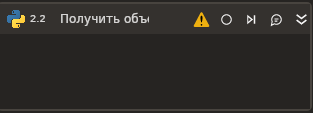

# Получить объект

Элемент позволяет получить значение объекта из выполняемой области скрипта Python.

### Свойства
Описание общих свойств элемента см. в разделе [Свойства элемента](https://docs.primo-rpa.ru/primo-rpa/primo-studio/process/elements#svoistva-elementa).\
Символ `*` в названии свойства указывает на обязательность заполнения.

**Объект:**

1. **Имя\*** *[String]* - Название объекта Python.
1. **Тип** *[Type]* - Тип данных объекта.
 
**Вывод:**
1. **Переменная** - Переменная для сохранения результата. Тип данных переменной вывода системой не задан.
