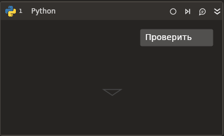

# Python

:bangbang: ***Требует наличия на машине установленного Python 3.9.***

Представляет собой элемент-контейнер, который устанавливает соединение с Python. 
Кнопка **Проверить** на панели элемента позволяет протестировать настроенное соединение.

### Свойства
Описание общих свойств элемента см. в разделе [Свойства элемента](https://docs.primo-rpa.ru/primo-rpa/primo-studio/process/elements#svoistva-elementa).\
Символ `*` в названии свойства указывает на обязательность заполнения.

1. **Путь к Python\*** *[String]* - Путь к файлу python.exe.
1. **Размер буфера** *[Int32]* - Размер буфера обмена. По умолчанию установлено значение `65535`.
1. **Консоль** *[Boolean]* - Если нужно показывать окно консоли, установите галочку.
1. **Тайм-аут** *[Int32]* - Тайм-аут соединения с Python в миллисекундах.
