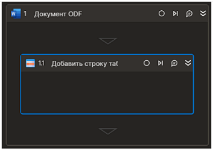

# Добавить строку таблицы



Элемент добавляет строку к таблице. Элемент работает корректно только внутри контейнера "Документ ODF"

## Свойства
Символ `*` в названии свойства указывает на обязательность заполнения. Описание общих свойств см. в разделе [Свойства элемента](https://docs.primo-rpa.ru/primo-rpa/primo-studio/process/elements#svoistva-elementa).

**Индекс\*** *[Int32]* - Порядковый номер таблицы (отсчет ведется с нуля). Пример: `1`  
**Данные** *[List<String>]* - Данные строки. Пример: `new List<string>(){"a","b"}`  
**Строка** *[System.Data.DataRow]* - Данные строки. Пример: `table.NewRow()`  

## Только код
Пример использования элемента в процессе с типом **Только код** (Pure code):

  
  
```csharp  
Primo.Office.OdfOxml.WordApp app = Primo.Office.OdfOxml.WordApp.Init(wf, "fileName");  
app.AddTableRow(0, new List<String> { "cell1" });  
```
  
  
```python  
dt = List[String]()  
dt.Add("cell1")  
app = Primo.Office.OdfOxml.WordApp.Init(wf, "fileName")  
app.AddTableRow(0, dt)  
```
  
  
```javascript  
var host = new _lib.Microsoft.ClearScript.HostFunctions();  
var lst = host.newObj(_lib.System.Collections.Generic.List(_lib.System.String));  
lst.Add("cell1");  
var app = _lib.Primo.Office.OdfOxml.WordApp.Init(wf, "fileName");  
app.AddTableRow(0, lst);  
```
  
  

