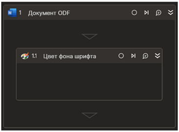

# Цвет фона шрифта



Элемент обрабатывает цвет фона текста документа. Элемент работает корректно только внутри контейнера "Документ ODF".

## Свойства

Символ `*` в названии свойства указывает на обязательность заполнения. Описание общих свойств см. в разделе [Свойства элемента](https://docs.primo-rpa.ru/primo-rpa/primo-studio/process/elements#svoistva-elementa).

**Word**  
1. **Начало** *[Int32]* - Индекс символа начала текста (отсчет ведется с нуля, значение по умолчанию - ноль). Пример: `12`  
1. **Длина** *[Int32]* - Длина текста (по умолчанию - до конца документа). Пример: `25`  
1. **Изменить цвет** *[Boolean]* - Признак изменения цвета. Пример: `true`  
1. **Новый цвет** *[System.Drawing.Color]* - Устанавливаемый цвет фона. Пример: `System.Drawing.Color.LightBlue`

**Вывод**  
1. **Цвет** *[System.Drawing.Color]* - Переменная для сохранения текущего цвета фона. Если фрагмент имеет несколько цветов фона, устанавливается System.Drawing.Color.Transparent.

## Только код  
Пример использования элемента в процессе с типом **Только код** (Pure code):    
  
  
```csharp  
System.Drawing.Color color = app.GetTextBackground(10, 25);  
app.SetTextBackground(10, 25, new System.Drawing.Color(255, 100, 0, 0));  
```
  
  
```python  
color = app.GetTextBackground(10, 25); #System.Drawing.Color 
app.SetTextBackground(10, 25, System.Drawing.Color(255, 100, 0, 0))  
```
  
  
```javascript  
var color = app.GetTextBackground(10, 25); //_lib.System.Drawing.Color  
app.SetTextBackground(10, 25, clr);  
```
  
  
