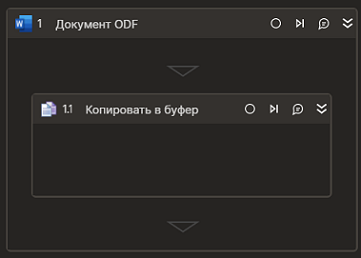

# Копировать в буфер обмена



Элемент копирует текст в буфер обмена. Элемент работает корректно только внутри контейнера "Документ ODF".

### Свойства
Символ `*` в названии свойства указывает на обязательность заполнения. Описание общих свойств см. в разделе [Свойства элемента](https://docs.primo-rpa.ru/primo-rpa/primo-studio/process/elements#svoistva-elementa).

**Текст**:
1. **Начало** *[Int32]* - Индекс символа начала текста для копирования в буфер обмена (отсчет ведется с нуля, значение по умолчанию - ноль). Пример: `12`.
2. **Длина** *[Int32]* - Длина текста (количество символов) для копирования в буфер обмена (по умолчанию - до конца документа). Пример: `24`.

### Только код  
Пример использования элемента в процессе с типом **Только код** (Pure code):  

  
  
```csharp  
Primo.Office.OdfOxml.WordApp app = Primo.Office.OdfOxml.WordApp.Init(wf, "fileName");  
app.CopyToClipboard( 12, 24);  
```
  
  
```python  
app = Primo.Office.OdfOxml.WordApp.Init(wf, "fileName")  
app.CopyToClipboard( 12, 24)  
```
  
  
```javascript  
let app =  _lib.Primo.Office.OdfOxml.WordApp.Init(wf, "fileName");  
app.CopyToClipboard( 12, 24);  
```
  
  
