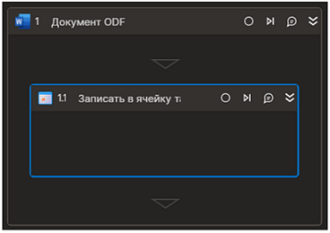

# Записать в ячейку таблицы
Элемент записывает текст в ячейку таблицы

Элемент работает корректно только внутри контейнера  "Документ ODF"
## Свойства
Символ `*` в названии свойства указывает на обязательность заполнения. Описание общих свойств см. в разделе [Свойства элемента](https://docs.primo-rpa.ru/primo-rpa/primo-studio/process/elements#svoistva-elementa).

**Word**  
**Индекс\*** *[Int32]* - Порядковый номер таблицы (отсчет ведется с нуля). Пример: `0`  
**Данные** *[string]* - Данные ячейки. Пример: `"строка"`  
**Строка** *[Int32]* - Индекс строки  (отсчет ведется с нуля). Пример: `1`  
**Колонка** *[Int32]* - Индекс колонки  (отсчет ведется с нуля). Пример: `2`  

## Только код  
Пример использования элемента в процессе с типом **Только код** (Pure code):  
  
  
```csharp  
Primo.Office.OdfOxml.WordApp app = Primo.Office.OdfOxml.WordApp.Init(wf, "fileName");  
app.WriteTableCell(idx, data, row, col);  
```
  
  
```python  
app = Primo.Office.OdfOxml.WordApp.Init(wf, "fileName")  
app.WriteTableCell(idx, data, row, col)  
```
  
  
```javascript  
var app =  _lib.Primo.Office.OdfOxml.WordApp.Init(wf, "fileName");  
app.WriteTableCell(idx, data, row, col);  
```
  
  
