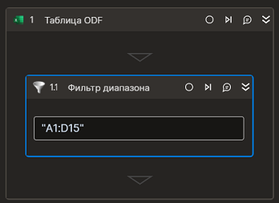

# Фильтр диапазона



Компонент устанавливает фильтр диапазона ячеек таблицы.

### Свойства
Символ `*` в названии свойства указывает на обязательность заполнения. Описание общих свойств см. в разделе [Свойства элемента](https://docs.primo-rpa.ru/primo-rpa/primo-studio/process/elements#svoistva-elementa).

| Свойство     | Тип    | Описание                                  | Пример          |
| ------------ | ------ | ----------------------------------------- | --------------- |
| **Таблица:** | | | |
| Диапазон** | String | Диапазон ячеек | `"A1:D12"` |
| Страница | String | Наименование страницы (работает, только когда не указан индекс страницы)| `"Лист 1"` |
| Индекс страницы | Int32 | Индекс страницы (отсчет ведется с нуля; значение по умолчанию - `0`, когда название страницы также не указано) | `1` |
| Фильтр | List<string> | Значения фильтра | 
| Индекс колонки | Int32 | Индекс колонки, по которой производится фильтрация (отсчет ведется с нуля; значение по умолчанию - `0`) | `2` |

### Только код
Пример использования элемента в процессе с типом **Только код** (Pure code):



```csharp
Primo.Office.OdfOxml.ExcelApp app = Primo.Office.OdfOxml.ExcelApp.Init(wf, [file]);
app.FilterRange(new List<string>(), "A1:C12", "Лист1", null,1);
```



```python
Primo.Office.OdfOxml.ExcelApp app = Primo.Office.OdfOxml.ExcelApp.Init(wf, [file])
app.FilterRange(new List<string>(), "A1:C12", "Лист1", null,1)
```



```javascript
Primo.Office.OdfOxml.ExcelApp app = Primo.Office.OdfOxml.ExcelApp.Init(wf, [file]);
app.FilterRange(new List<string>(), "A1:C12", "Лист1", null,1);
```


