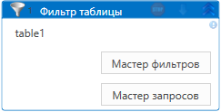
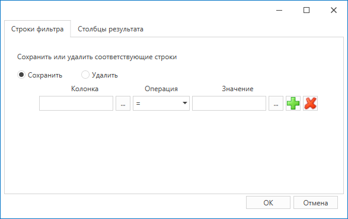
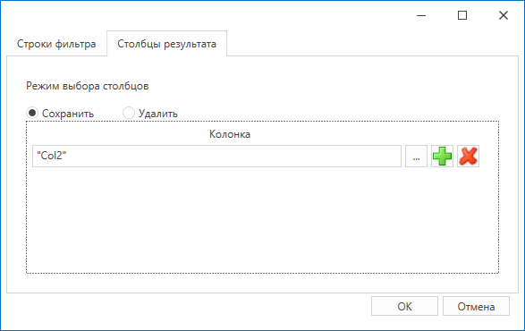

# Фильтр таблицы
*Eng: Table filter*

Данный элемент предназначен для фильтрации данных в таблице. 

Работает с входной переменной типа DataTable, хранящей таблицу. Эту переменную можно получить, например, с помощью операции "Чтение диапазона" Excel-файла. [**Чтения диапазона**](https://docs.primo-rpa.ru/primo-rpa/g\_elements/osnovnye-elementy/prilozhenie-excel/el\_excel\_readrange) Excel-файла.

Существуют три способа указать запрос для фильтрации:

:bangbang: _**Запрос указывается только одним из перечисленных способов:**_

1. В свойстве **Запрос**. Имеет приоритет над окнами мастеров, поддерживает переменные. Результатом будет таблица с данными, соответствующими условиям запроса.
2. В окне **мастера фильтров**. Помимо указания запроса, предоставляет на выбор действие с результатом: удаление либо сохранение искомых данных.
3. В окне **мастера запросов**. В результате вернется таблица только с найденными данными.

### Мастер фильтров

При нажатии кнопки **Мастер фильтров** откроется окно вида:

Выбор вкладки определяет настройки либо для строк, либо для колонок таблицы.

1. На вкладке **Строки фильтра** формируется запрос. Для этого:
   * В поле **Колонка** укажите столбец, данные по которому нужно отфильтровать. Значение следует указывать в кавычках, независимо от формата ячейки. Пример: `"1"`.
   * В поле **Операция** выберите операцию сравнения данных.
   * Заполните поле **Значение**. Указывайте значение в кавычках `" "` вне зависимости от формата ячейки в самой таблице. Например, если настроен фильтр по столбцу с датой, то ее тоже следует указывать в кавычках.
2. По кнопке  (3) (1) (1) (1) (1).png>) можно добавить новое условие с оператором И/ИЛИ. Кнопка  (1) (2) (1) (1) (1) (4).png>) удаляет ненужное условие.
3. Выберите действие, которое нужно совершить с результатом: **Сохранить** (по умолчанию) или **Удалить**. При сохранении в таблице будут выведены только найденные данные. При удалении - вернется отсортированная таблица, из которой удалена указанная строка (-и).

На вкладке **Столбцы результата** можно задать название колонок, которые требуется либо сохранить, либо удалить из результата. Название прописывается в кавычках:

### Мастер запросов

При нажатии кнопки **Мастер запросов** откроется окно вида:

Запрос формируется аналогично мастеру фильтров. Текст сформированного запроса можно просмотреть по нажатию кнопки **Запрос**.

После заполнения всех нужных параметров нажмите кнопку **ОК**.

В случае, если результат фильтрации не удовлетворяет ни одному из условий, вернется только структура таблицы.

## Свойства

Описание общих свойств элемента см. в разделе [Свойства элемента](https://docs.primo-rpa.ru/primo-rpa/primo-studio/process/elements#svoistva-elementa).\
Символ `*` в названии свойства указывает на обязательность его заполнения.

| Свойство                     | Тип                                                                                                      | Описание                                                                                                                             |
| ---------------------------- | -------------------------------------------------------------------------------------------------------- | ------------------------------------------------------------------------------------------------------------------------------------ |
| _**Управление коллекцией:**_ |                                                                                                          |                                                                                                                                      |
| Таблица\*                    | [System.Data.DataTable](https://learn.microsoft.com/ru-ru/dotnet/api/system.data.datatable?view=net-5.0) | Переменная, содержащая таблицу данных                                                                                                |
| Запрос                       | String                                                                                                   | Текст запроса таблицы данных. Если не заполнено, то запрос формируется по данным мастера запросов/фильтров                           |
| Мастер                       |                                                                                                          | Данные из мастера фильтров. **Важно**: при очистке запроса в мастере свойство остается заполненным - удалите его, если это требуется |
| _**Вывод:**_                 |                                                                                                          |                                                                                                                                      |
| Переменная\*                 | System.Data.DataTable                                                                                    | Переменная для сохранения результатов фильтрации таблицы                                                                             |

Пример проекта можно загрузить по ссылке: [Фильтр таблицы.ltw](https://github.com/PrimoRPA/Learning/blob/master/StudioActivities/Ru/%D0%9A%D0%BE%D0%BB%D0%BB%D0%B5%D0%BA%D1%86%D0%B8%D0%B8/%D0%A4%D0%B8%D0%BB%D1%8C%D1%82%D1%80%20%D1%82%D0%B0%D0%B1%D0%BB%D0%B8%D1%86%D1%8B.ltw)

