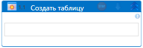

# Создать таблицу



Компонент создает таблицу на заданном листе Excel.

**Общие сведения**:

1. Путь до файла, тип драйвера и прочие параметры предварительно настраиваются в контейнере [Приложение Excel](https://docs.primo-rpa.ru/primo-rpa/g_elements/el_basic/els_excel/el_excel_app).
2. Если в файле требуется сохранить изменения, то после создания таблицы используйте элемент [Сохранить документ](https://docs.primo-rpa.ru/primo-rpa/g_elements/el_basic/els_excel/el_excel_save).

### Свойства
Описание общих свойств элемента см. в разделе [Свойства элемента](https://docs.primo-rpa.ru/primo-rpa/primo-studio/process/elements#svoistva-elementa).\
Символ `*` в названии свойства указывает на обязательность заполнения.

| Свойство        | Тип    | Описание                                                                                                                                      |
| --------------- | ------ | --------------------------------------------------------------------------------------------------------------------------------------------- |
| _**Excel:**_    |        |                                                                                                                                              |
| Диапазон        | String | Диапазон таблицы. Пример: `"A1:D12"`                                                                                                          |
| Наименование    | String | Наименование будущей таблицы. Пример: `"Имя_таблицы"`                                                                                         |
| Страница        | String | Наименование страницы с диапазоном таблицы. Пример: `"Лист1"`                                                                                 |
| Индекс страницы | Int32  | Индекс страницы, отсчет начинается с 0. Пример: `0`                                                                                           |

### Только код
Пример использования элемента в процессе с типом **Только код** (Pure code):
  


```csharp
//app - [LTools.Office.ExcelApp] Приложение Excel
//range - Диапазон: [String] Диапазон таблицы (A1:D12)
//name - Наименование: [String] Наименование таблицы
//sheet - Страница: [String] Наименование страницы
//sheetIdx - Индекс страницы: [Int32] Индекс страницы
//app.CreateTable(range, name, [sheet], [sheetIdx]);
		
LTools.Office.ExcelApp app = LTools.Office.ExcelApp.Init(wf, @"c:\file.xlsx", ";", LTools.Office.Model.InteropTypes.DX);
app.CreateTable("*", "TableName", "Лист1", 0);
app.SaveAs(@"c:\file.xlsx");
```



```python
#app - [LTools.Office.ExcelApp] Приложение Excel
#range - Диапазон: [String] Диапазон таблицы (A1:D12)
#name - Наименование: [String] Наименование таблицы
#sheet - Страница: [String] Наименование страницы
#sheetIdx - Индекс страницы: [Int32] Индекс страницы
#app.CreateTable(range, name, [sheet], [sheetIdx])
		
app = LTools.Office.ExcelApp.Init(wf, @"c:\file.xlsx", ";", LTools.Office.Model.InteropTypes.DX)
app.CreateTable("*", "Tab", "Лист1", 0)
app.SaveAs(@"c:\file.xlsx")
```



```javascript
var host = new _lib.Microsoft.ClearScript.HostFunctions();
var lst = host.newObj(_lib.System.Collections.Generic.List(_lib.System.Collections.Generic.List(_lib.System.String)));
var lst2 = host.newObj(_lib.System.Collections.Generic.List(_lib.System.Collections.Generic.List(_lib.LTools.Office.Model.ExcelCellInfo)));
var lst3 = host.newObj(_lib.System.Data.DataTable);
var app = _lib.LTools.Office.ExcelApp.Init(wf, @"c:\file.xlsx", ";", _lib.LTools.Office.Model.InteropTypes.DX);	
app.CreateTable("*", "Tab", "Лист1", 0);
app.SaveAs(@"c:\file.xlsx");
```


