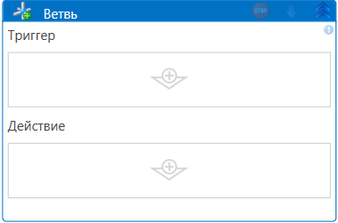

# Ветвь

**Ветвь (Pick branch)** - элемент предназначен для размещения в контейнере [**Выбрать ветвь**](https://docs.primo-rpa.ru/primo-rpa/g\_elements/osnovnye-elementy/els\_logic/el\_logic\_pickbranch). 

Принцип работы следующий: 

1. В один контейнер помещаем несколько ветвей.
2. Для каждой из ветвей настраиваем триггер и действие, выполняемое при срабатывании этого триггера.

  
  
3. В ходе работы робота в параллельном режиме запустится ожидание срабатывания триггера одной из ветвей.
4. Выбрана будет первая ветвь, вернувшая значение истины (**true**) при проверке. Остальные ветви проигнорируются.

## Как настроить Ветвь

1. В область триггера перетащите любой элемент, возвращающий булевое значение (true или false). Например, [**Существует файл/папка**](https://docs.primo-rpa.ru/primo-rpa/g_elements/el_basic/els_files/el_files_exists).\
   **В триггере может быть только одно условие**.

   

3. В область действия перетащите элемент с той активностью, которую нужно запустить при успешном выполнении условия. Например, [**Запись в журнал**](https://docs.primo-rpa.ru/primo-rpa/g\_elements/osnovnye-elementy/els\_dialogs/el\_dialogs\_addlog). Действий может быть несколько.
4. Дополнительно можно заполнить общие свойства элемента. Их описание см. в разделе [**Работа с элементами**](https://docs.primo-rpa.ru/primo-rpa/primo-studio/process/elements).

## Дополнительно

Начиная с версии 1.24.4 к работе ветвления в **Pick branch** добавлена функциональность, позволяющая задать действие по умолчанию для ситуаций, когда не срабатывает ни один из условных ветвей Pick branch.
Для настройки действия по умолчанию используется элемент **Ожидание**(Wait), вставленный в триггер действия. Если за заданный период времени не происходит активации других триггеров, срабатывает действие по умолчанию.

## Демонстрационный проект

На портале [Learning](https://github.com/PrimoRPA/Learning) находится проект **StudioActivities**. При помощи простых сценариев в нем демонстрируется работа основных элементов Студии.

Процесс с демонстрацией работы ветвей можно найти в подпапке:
* StudioActivities > En > Flow control > Branches.ltw - на англ.яз.;
* StudioActivities > Ru > Управление > Выбор ветви.ltw - на рус. яз.

Запустите в Студии этот процесс, чтобы наглядно ознакомиться с работой ветвей.

