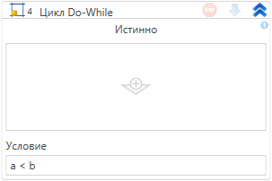

# Цикл Do-While

*Eng: Do-While*

Элемент представляет собой цикл **Do-While**, который продолжает выполняться до тех пор, пока заданное логическое выражение остается истинным. Отличительной особенностью цикла **Do-While** является то, что условие проверяется в конце каждой итерации, что гарантирует выполнение тела цикла хотя бы один раз, даже если условие изначально ложно.

**Цикл Do-While** в RPA-проектах особенно полезен, когда требуется гарантировать выполнение действий хотя бы один раз и продолжать их до тех пор, пока выполняется определенное условие. Этот цикл идеально подходит для сценариев, где количество итераций неизвестно заранее или зависит от динамически изменяющихся условий, например, при обработке данных из источников, где количество элементов заранее не определено.

## Свойства

Символ `*` в названии свойства указывает на обязательность заполнения. Описание общих свойств см. в разделе [Свойства элемента](https://docs.primo-rpa.ru/primo-rpa/primo-studio/process/elements#svoistva-elementa).

| Свойство    | Тип     | Описание                                                                 |
|-------------|---------|--------------------------------------------------------------------------|
| Выражение\* | Boolean | Логическое выражение, истинность которого проверяется в конце каждой итерации цикла. Это выражение определяет, будет ли цикл продолжаться или завершится. |

##  Learning

Для изучения работы с элементом **Do-While**, вы можете скачать обучающий RPA-проект по следующей ссылке: [Скачать архив Learning](https://github.com/PrimoRPA/Learning/archive/refs/heads/master.zip)

1. Скачайте архив с обучающими материалами с указанной страницы.
2. Распакуйте архив и откройте проект `StudioActivities` в вашей среде разработки.
3. Найдите процесс `StudioActivities/Ru/Управление/Циклы.ltw` для изучения работы элемента.

## Частые ошибки при использовании цикла Do-While:

1. **Бесконечный цикл:** 
   - Это происходит, когда условие цикла всегда остается истинным, и цикл никогда не завершается. Это может быть вызвано неправильной логикой или отсутствием обновления переменных, используемых в условии.

2. **Неправильная логика условия:**
   - Ошибки в формулировке условия могут привести к тому, что цикл либо не выполняется вовсе, либо завершается раньше, чем требуется, что приводит к неполному выполнению задачи.
