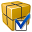

# Primo.Collections

Библиотека **Primo.Collections** позволяет автоматизировать работу с таблицами. 

В библиотеку входят следующие элементы:
* [**Построить таблицу**](https://docs.primo-rpa.ru/primo-rpa/g_elements/el_extra/els_collections/build) — создает таблицу на основе данных, указанных в Мастере. Результат сохраняется в переменную типа DataTable.
* [**Соединить таблицы**](https://docs.primo-rpa.ru/primo-rpa/g_elements/el_extra/els_collections/join) — производит объединение двух таблиц по указанным столбцам.
* [**Изменить значение**](https://docs.primo-rpa.ru/primo-rpa/g_elements/el_extra/els_collections/updaterowitem) — обновляет значение строки в таблице DataTable в соответствии с указанным столбцом. 
* [**Получить значение**](https://docs.primo-rpa.ru/primo-rpa/g_elements/el_extra/els_collections/getrowitem) — извлекает значение строки из таблицы DataTable в соответствии с указанным столбцом.

Перечисленные элементы станут доступны только после установки библиотеки. Они будут находиться на панели элементов в группе **Данные > Таблицы**. 

## Установка библиотеки

1. [Скачайте](https://www.nuget.org/packages/Primo.Collections) пакет **Primo.Collections** с портала NuGet.
2. Откройте Primo RPA Studio и нажмите в главном меню кнопку **Управление зависимостями** .
3. В окне **Управление зависимостями** перейдите на вкладку **Студия**. Выберите опцию загрузки и укажите путь к скачанному файлу пакета.

   

4. Находясь на вкладке **Студия**, выберите пакет **Primo.Collection** и нажмите кнопку **Установить**. А затем — сохраните изменения. 

   

5. Готово — библиотека **Primo.Collection** установлена в качестве зависимости Студии. Немного подождите, пока зависимость загрузится, и можете перейдить на панель элементов.
