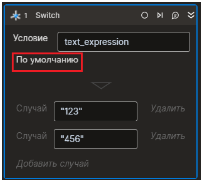

# Switch

Компонент производит проверку выражения и выполняет одну из имеющихся ветвей в зависимости от результата.

Как это работает:

1\. В свойстве **Условие** укажите выражение, которое нужно проверить на совпадение. Используйте переменную.\
2\. По кнопке **Добавить случай** добавьте значение для сравнения с условием. Добавьте столько случаев (case), сколько необходимо.

:small\_blue\_diamond: _**Примечание.**_ _Удалить условие можно по соответствующей кнопке._

3\. При выполнении элемента **Switch** выражение пройдет проверку по каждому случаю. В результате совпадения выполнится последовательность операций, закрепленная за случаем (2). Последовательность задается по нажатию кнопки **Случай** (1).

4\. Если не будет найдено ни одного совпадения, выполнится операция по умолчанию. Ее можно задать, нажав кнопку **По умолчанию**.

## Свойства

Символ `*` в названии свойства указывает на обязательность заполнения. Описание общих свойств см. в разделе [Свойства элемента](https://docs.primo-rpa.ru/primo-rpa/primo-studio/process/elements#svoistva-elementa). 

| Свойство  | Тип | Описание            |
| --------- | --- | ------------------- |
| Условие\* |     | Проверяемое условие |

## Learning 

На странице [Learning](https://github.com/PrimoRPA/Learning) доступен RPA-проект, демонстрирующий работу элемента.

1. Скачайте архив со всеми обучающими материалами по ссылке: [Скачать архив Learning](https://github.com/PrimoRPA/Learning/archive/refs/heads/master.zip).
2. Распакуйте архив и откройте в Студии проект **StudioActivities**.
3. Выберите процесс `StudioActivities/Ru/Управление/Switch.ltw` для просмотра.
