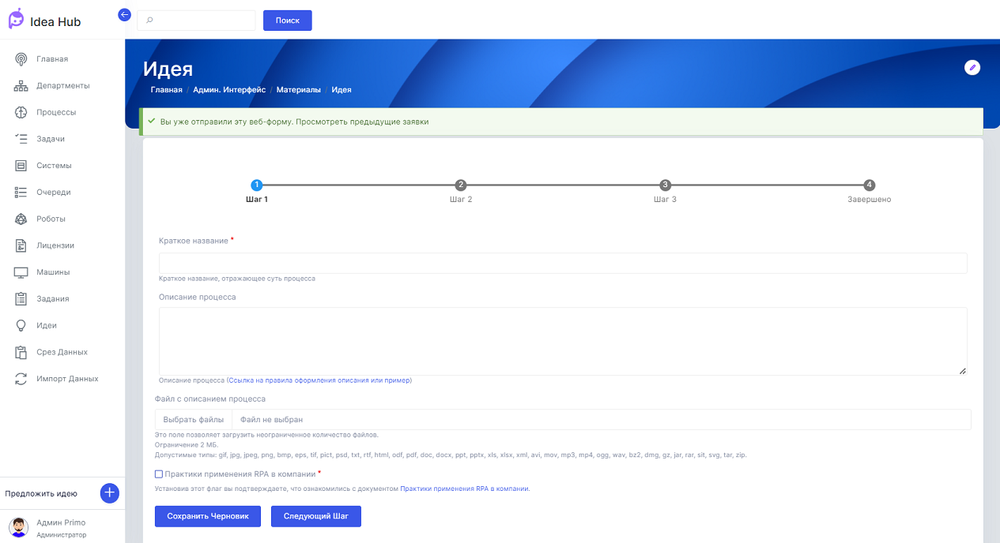

# Работа с идеями

## Оформление идеи (заявки на роботизацию)

Для того, чтобы сформировать заявку на роботизацию, нажмите кнопку **Предложить идею**, расположенную в левой нижней части экрана. Данная кнопка доступна на всех страницах пользовательского сайта.

После нажатия на кнопку откроется форма для внесения информации по предлагаемой идее роботизации. Поля формы, отмеченные значком “*” (звездочка), обязательны для заполнения.

Процесс формирования идеи состоит из нескольких шагов и соответствующих им частей формы. 

- **Шаг 1**

**Краткое название** — произвольное название процесса. Рекомендуется давать процессам названия, отражающие их сущность.

**Описание процесса** — более подробная информация о процессе, текстовое значение. 

**Файл с описанием процесса** — вы можете прикрепить неограниченное количество файлов указанных форматов, размером не более 100 МБ.

**Практики применения RPA в компании** — отметьте данный флажок, чтобы согласиться с правилами, которых нужно придерживаться при подаче заявки на роботизацию. С правилами можно ознакомиться, перейдя по ссылке рядом с флажком.

Далее нажмите кнопку **Следующий Шаг** для перехода на следующую страницу или кнопку **Сохранить Черновик**, если вы хотите прервать заполнение формы и вернуться к ней позже. Чтобы вернуться к незаконченному черновику, снова нажмите кнопку **Предложить идею**.

🔸**ВНИМАНИЕ**: Невозможно начать оформление новой идеи, пока не будет закончено оформление текущей (то есть, пока текущая идея находится в статусе черновика).

- **Шаг 2**

**Модель расчета эффектов** — с помощью этой модели можно сделать предварительный расчет экономического эффекта от внедрения предлагаемой идеи роботизации. Кликните на стрелку и выберите нужную модель из выпадающего списка.

Внесите необходимые данные в поля Оклад, Количество сокращаемых FTE. Данные в остальных полях будут рассчитаны автоматически.

Дополнительную информацию можно добавить в поле Комментарии.

- **Шаг 3**

**Ключевой пользователь** — выберите из списка основного пользователя процесса.

**Подразделения** — выберите одно или несколько подразделений, в которых будет работать процесс.

**Системы** — укажите системы, с которыми будет взаимодействовать робот при выполнении RPA-проекта.

**Файлы** — в данном поле можно задать, с файлами каких форматов будет работать робот.

После нажатия кнопки **Отправить** сформированная заявка на роботизацию будет отправлена. При этом сотрудникам компании, ответственным за роботизацию, по электронной почте будет направлено уведомление о поступлении новой заявки.

## Одобрение заявки на роботизацию

Список сформированных идей и их статус можно посмотреть на странице **Идеи** (Главная страница / Идеи). В случае одобрения в графе *Статус Заключения* будет стоять статус *Одобрено*.

Решение об одобрении или отклонении заявки принимается сотрудниками Центра RPA  компетенций компании по результатам оценки затрат на реализацию и экономической целесообразности роботизации конкретной идеи. 

Для сотрудников Центра RPA компетенций с соответствующими правами доступа внутри Idea Hub на странице **Идеи** доступна ссылка *Создать заключение*:

При переходе по данной ссылке открывается страница **Заключение**, где указаны данные из заявки на роботизацию.

В поле *Важная информация для разработчиков RPA* могут быть добавлены произвольные комментарии по заявке и ее реализации.

На странице **Заключение** сотрудники Центра RPA компетенций делают предварительный расчет стоимости внедрения и эксплуатации процесса, включая трудозатраты на реализацию робота, стоимость лицензии, длительность эксплуатации решения и т.д. В результате расчета будет получена информация об ожидаемой экономии от внедрения RPA-решения в денежном и процентном выражении.

Далее сотрудник Центра RPA компетенций одобряет или отклоняет заявку. Уведомление об этом автоматически отправляется по электронной почте заинтересованным лицам при наличии соответствующих настроек.

## Связь идеи и процесса

Сразу после того, как будет создана идея, также создается ассоциированный с ней процесс. Его можно посмотреть, перейдя по ссылке *Смотреть процесс*:

Новый процесс появится на вкладке **Процессы**:

После разработки RPA-решения и создания проектов на стороне Оркестратора сотрудник Центра RPA компетенций компании может связать новый процесс с этими проектами через выбор имени нужного проекта в выпадающем списке *Проекты* для данного процесса.

Для доступа к полю *Проекты* войдите на вкладку **Процессы** через меню в левой части экрана. Выберите нужный процесс и кликните на его названии - при этом откроется страница с информацией. Кликните на иконке “ручка” и выберите Изменить: 

В появившемся слева меню выберите вкладку **Оркестратор**.

Далее в выпадающем списке *Проекты* выберите один или несколько проектов, связанных с вашим процессом.

После привязки к процессу проектов в нем появится статистика запуска проектов (если они уже запускались), которую можно будет использовать в расчетах.

