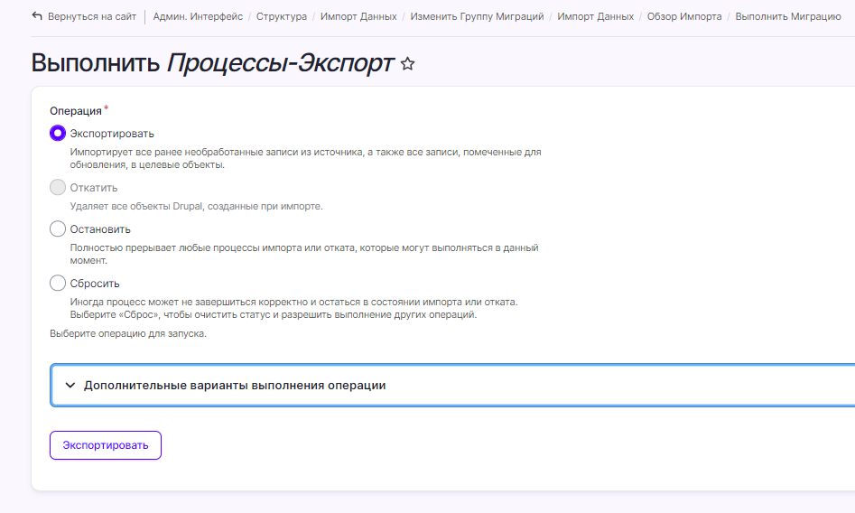

# Экспорт данных

Данные, которые относятся к процессам, могут быть экспортированы из Idea Hub в виде файла `process.xlsx`. При использовании этой возможности экспортироваться будут все заполненные поля в Idea Hub, для которых включена возможность импорта и экспорта.

## Включить экспорт для поля

1. В административном меню выберите раздел **Структура > Типы материалов**.
1. Для типа материала **Процесс** нажмите кнопку **Управление полями**. Откроется страница **Управление полями** со списком всех полей процесса, которые существуют на текущий момент. 

   

1. Нажмите кнопку **Изменить** напротив названия поля в списке.

   

1. Активируйте переключатель **Включить импорт/экспорт поля**, чтобы добавить это поле в шаблон файла `process.xlsx` для экспорта.

   

## Экспортировать поля процесса

1. Перейдите на страницу **Импорт данных**.
1. В таблице данных, для записи **Процессы-Экспорт**, нажмите кнопку **Экспортировать**. Откроется страница **Выполнить**:

   

Большинство элементов данной формы аналогичны странице **Выполнить** для импорта данных. 

Дополнительный элемент: 

**Экспортировать вычисленное значение формулы** — переключатель определяет, будет ли экспортирована сама формула, как она хранится в базе данных, 
или ее вычисленное значение. Используется для полей, которые хранят в себе формулы, значение которых вычисляется каждый раз при обращении к этому полю.

🔸**ВНИМАНИЕ. Если экспортируемый файл будет в дальнейшем предназначаться для реимпорта в Idea Hub, то не следует активировать данный переключатель при экспорте. В противном случае, в ходе импорта формулы, которые хранятся в базе данных Idea Hub, будут заменены на значения из импортируемого файла. Это значит, что возможность производить вычисления по ним в Idea Hub будет утеряна.**

После нажатия кнопки **Экспортировать** откроется страница с индикатором прогресса. 

Если параметр **Экспортировать вычисленное значение формулы** был включен, процесс экспорта может занять некоторое время, так как потребует вычисления значений всех формул.

По окончании процесса экспорта будет открыта страница **Импорт данных** с сообщением о деталях выполненного экспорта.

Для скачивания полученного файла нажмите на ссылку **Получить экспортированный файл**. Данный файл будет содержать все колонки, для которых включена возможность экспорта, и все данные в этих колонках.
