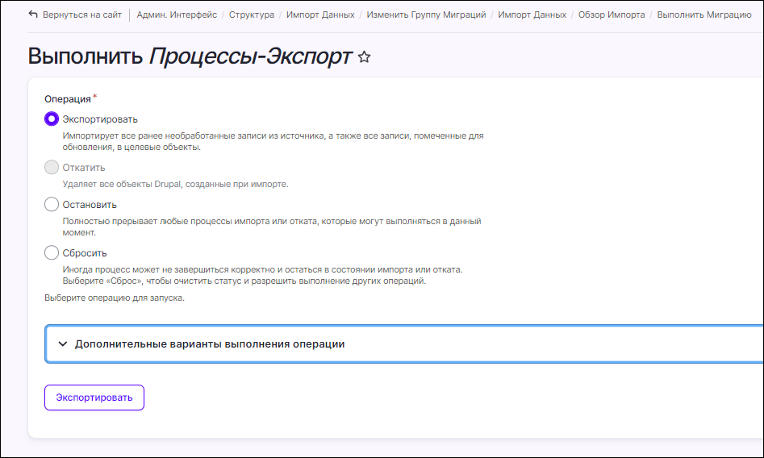
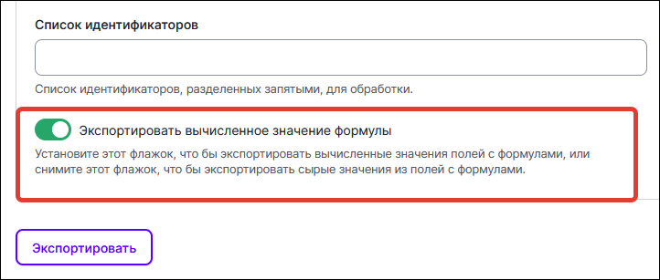

# Экспорт данных

Данные, которые относятся к процессам, могут быть экспортированы из Idea Hub в виде файла `process.xlsx`. 

При использовании этой возможности экспортироваться будут все заполненные поля в Idea Hub, для которых включена возможность импорта и экспорта.

## Включить возможность импорта/экспорта

Чтобы включить возможность импорта/экспорта для поля:
1. В административном меню выберите раздел **Структура > Типы материалов**.
1. Для типа материала **Процесс** нажмите кнопку **Управление полями**. Откроется страница **Управление полями** со списком всех полей процесса, которые существуют на текущий момент. 

   

1. В записи нужного поля нажмите кнопку **Изменить**.

   

1. Активируйте переключатель **Включить импорт/экспорт поля**, чтобы добавить это поле в шаблон файла `process.xlsx` для экспорта.

   

1. Сохраните настройки.

## Экспортировать данные процессов

Чтобы экспортировать данные в файл `process.xlsx`:
1. Перейдите на страницу **Импорт данных**.
1. В таблице найдите запись **Процессы-Экспорт** и нажмите кнопку **Экспортировать**.

     

   Откроется страница **Выполнить**. Большинство элементов данной формы аналогичны странице **Выполнить** для импорта данных.

   

1. Разверните блок с дополнительными вариантами выполнения операции. Там вы увидите дополнительный элемент:
    * **Экспортировать вычисленное значение формулы** — переключатель определяет, будет ли экспортирована сама формула, как она хранится в базе данных, или ее вычисленное значение. Используется для полей, которые хранят в себе формулы, значение которых вычисляется каждый раз при обращении к этому полю. Если настройка включена, то будут экспортироваться результаты вычисления формул, если выключена, то исходные формулы. 

   

    :large_orange_diamond:**ВНИМАНИЕ. Если экспортируемый файл будет в дальнейшем предназначаться для реимпорта в Idea Hub, то не следует активировать данный переключатель при экспорте. В противном случае, в ходе импорта формулы, которые хранятся в базе данных Idea Hub, будут заменены на значения из импортируемого файла. Это значит, что возможность производить вычисления по ним в Idea Hub будет утеряна.**

1. Нажмите кнопку **Экспортировать**.
  
В результате откроется страница с индикатором прогресса экспорта. Если параметр **Экспортировать вычисленное значение формулы** был включен, процесс экспорта может занять некоторое время, так как потребует вычисления значений всех формул.

  

По окончании экспорта будет открыта страница **Импорт данных** с сообщением о деталях выполненного экспорта.

Для скачивания полученного файла нажмите ссылку **Получить экспортированный файл**. Файл `process.xlsx` будет содержать все колонки, для которых включена возможность экспорта, и все данные в этих колонках. Описание основных полей файла вы можете найти [здесь](https://docs.primo-rpa.ru/primo-rpa/primo-rpa-idea-hub/import-export/file-process).

  

## Что дальше

В файл `process.xlsx` можно вносить изменения, если они требуются, и затем импортировать в Idea Hub. Это позволяет массово изменять данные в текущих процессах, не редактируя каждый процесс по отдельности через интерфейс.

Для импорта откройте страницу **Импорт данных**, найдите запись **Процессы** и нажмите кнопку **Загрузить файл**.

  

Выберите файл `process.xlsx` и нажмите кнопку **Загрузить файл**.

   

