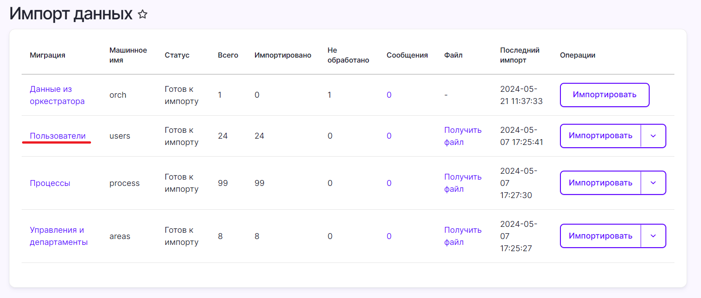

# Файл users.xlsx

Файл `users.xlsx` используется для массового импорта пользователей, которые являются владельцами автоматизируемых процессов. Данный файл следует заполнить вручную и затем загрузить на странице **Импорт данных**. 

Скачать шаблон файла `users.xlsx` можно по [ссылке](https://github.com/PrimoRPA/Docs.Rus/tree/main/file-for-download). При пересохранении файла не меняйте его название и расширение.

## Описание полей файла users.xlsx

- **id** — идентификатор пользователя.
- **first_name** — имя пользователя.
- **middle_name** — отчество пользователя.  
- **last_name** — фамилия пользователя.  
- **email** — адрес электронной почты пользователя.  

## Импорт пользователей

Заполненный файл `users.xlsx` следует загрузить в веб-интерфейсе Idea Hub на странице **Импорт данных**. Для выполнения данного действия пользователю нужны права администратора.

Чтобы загрузить файл:
* В строке **Пользователи** нажмите на стрелочку рядом с действием **Импортировать**.
* Выберите пункт **Загрузить файл**.
* Выберите файл для загрузки и нажмите **Загрузить файл**.

Готово — никаких дополнительных действий осуществлять не нужно. Когда вы будете импортировать файл с процессами, то информация о пользователях из файла `users.xlsx` импортируется автоматически.

