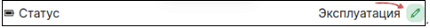

# Добавление полей

‼️ДОБАВИТЬ ИЛЛЮСТРАЦИИ ИЗ ОБНОВЛЕННОГО ИНТЕРФЕЙСА - КАКИЕ ИМЕННО КАРТИНКИ НУЖНЫ, МОЖНО ПОСМОТРЕТЬ ВОТ В ЭТОМ ФАЙЛЕ: https://docs.google.com/document/d/1rZLiiGc2EFZLC1FVSvcIHQ141GB7MA_4b5afViDx67I/edit?pli=1

‼️УТОЧНИТЬ, НУЖНА ЛИ ИНФА, ПРИВЕДЕННАЯ В САМОМ НИЗУ ТЕКСТА, ПОД ЗАГОЛОВКОМ Поля процесса в Idea Hub 
(ПРИМЕЧАНИЕ: РАЗДЕЛ "СПРАВОЧНО" - НУЖЕН ТОЧНО, ЕГО ОСТАВИТЬ В ДОКУМЕНТЕ)


В Idea Hub существует возможность добавления произвольного количества полей, которые также могут быть экспортированы/импортированы в файте process.xlsx (при указании соответствующих настроек). По умолчанию продукт уже содержит некоторый предустановленный набор полей, но в зависимости от потребностей организации он может быть расширен.

Для добавления новых полей используйте пункт Административного меню **Структура -> Типы материалов**:

ILLUSTRATION

Далее нажмите кнопку “Управление полями” для того типа материала, для которого необходимо добавить новое поле.

ILLUSTRATION

Откроется страница “Управление полями”, содержащая список всех полей, имеющихся на текущий момент для данного типа материала. В правом верхнем углу страницы расположена кнопка “Добавить поле”.

ILLUSTRATION

При нажатии на кнопку откроется страница “Добавить поле”. Выберите тип для добавляемого нового поля или выберите одно из существующих полей из выпадающего списка.

ILLUSTRATION

После добавления поле появится в списке на странице “Управление полями”.

Для определенных типов полей существует возможность указать, можно ли будет его заполнять с помощью импорта process.xslx файла. 
К таким типам полей относятся: datetime, file, entity_reference, integer, decimal, float, string, string_long, text_with_summary, workflow, formula.

Для изменения данной настройки нажмите на кнопку Изменить напротив названия поля в списке - откроется страница “Настройки поля”:

ILLUSTRATION

Основные настройки данной формы являются общими и не зависят от выбранного типа поля, но набор настроек в разделе “Настройка импорта/экспорта поля” может различаться.

Для того, чтобы добавить поле в шаблон файла process.xlsx для импорта/экспорта, активируйте флажок “Включить импорт/экспорт поля”:

ILLUSTRATION

Также в разделе “Настройка импорта/экспорта поля” есть флажок “Сделать прописной буквой первый символ в строке”, при включении которого в процессе импорта первая буква значения поля будет меняться на заглавную (если она была строчной).

Текстовое поле “Инструкция по заполнению” предназначено для указания краткой инструкции о том, как данное поле должно заполняться в файле process.xlsx. Эта инструкция будет показываться при наведении курсора мыши на заголовок соответствующей колонки в экспортированном файле. 

Кроме того, в данном разделе формы можно выбрать тип обработчика для импортируемых данных. Это нужно для корректного преобразования данных, полученных из файла при импорте. Набор возможных типов обработчиков зависит от типа поля.

Для типа поля “file” форма также содержит настройку “Изменить поведение, если файл уже существует”.
С помощью этой настройки определяется, каким должно быть поведение функциональности в случае, если файл с таким именем уже существует в системе:
Заменить - заменит существующий файл новым
Переименовать - файл будет переименован так, чтобы имя было уникальным
Использовать существующий файл

## Справочно: Типы полей и их настройки

Тип поля: datetime
Плагин: Date
Настройка: Результирующий формат даты. В большинстве случаев  менять настройку данного поля  не требуется. Если такая необходимость возникает, задаётся в формате, детально описанном здесь https://www.php.net/manual/datetime.format.php#refsect1-datetime.format-parameters


Тип поля: file
Плагин: Download and Create File
Настройка: Поведение, если файл в системе уже существует. Заменить файл на новый, переименовать новый файл, чтобы имя стало уникальным, либо использовать уже существующий файл, новый - игнорировать.


Тип поля: entity_reference
Плагин: New entity
Настройки: нет.
Плагин: Existing entity
Настройки:
- Имя поля (машинное имя поля), по которому искать существующую связанную сущность.
- Ignore case - игнорировать регистр букв (заглавные или нет)
Плагин: ProjectLookup
Настройки: Окружение - машинное название поля, из которого берется название окружения запуска роботов.
Плагин: schedule_lookup
Настройки: нет.


Типы поля: integer, decimal, float
Плагин: Number
Настройки: нет.


Типы поля: string, string_long, text_with_summary
Плагин: Text
Настройки: нет.


Тип поля: workflow
Плагин: Workflow
Настройки: нет.


Тип поля: formula
Плагин: Formula
Настройки: нет


= = = = =


# Поля процесса в Idea Hub

Ниже приведены описания полей процесса, информация о способах их отображения и процессах расчёта значений полей.

Список полей:

[Статус (field_workflow)](https://github.com/PrimoRPA/Docs.Rus/new/1347-%D0%BD%D0%B0%D0%BF%D0%B8%D1%81%D0%B0%D1%82%D1%8C-%D1%81%D1%82%D0%B0%D1%82%D1%8C%D1%8E-%D0%BF%D1%80%D0%BE-%D0%BF%D0%BE%D0%BB%D1%8F-%D0%BF%D1%80%D0%BE%D1%86%D0%B5%D1%81%D1%81%D0%B0-%D0%B2-idea-hub/idea-hub/processes#%D1%81%D1%82%D0%B0%D1%82%D1%83%D1%81-field_workflow)  
[Оркестратор подключен (comp orch connected)](https://github.com/PrimoRPA/Docs.Rus/new/1347-%D0%BD%D0%B0%D0%BF%D0%B8%D1%81%D0%B0%D1%82%D1%8C-%D1%81%D1%82%D0%B0%D1%82%D1%8C%D1%8E-%D0%BF%D1%80%D0%BE-%D0%BF%D0%BE%D0%BB%D1%8F-%D0%BF%D1%80%D0%BE%D1%86%D0%B5%D1%81%D1%81%D0%B0-%D0%B2-idea-hub/idea-hub/processes#%D0%BE%D1%80%D0%BA%D0%B5%D1%81%D1%82%D1%80%D0%B0%D1%82%D0%BE%D1%80-%D0%BF%D0%BE%D0%B4%D0%BA%D0%BB%D1%8E%D1%87%D0%B5%D0%BD-comp-orch-connected)  
[Средняя длительность запусков (field duration computed)](https://github.com/PrimoRPA/Docs.Rus/new/1347-%D0%BD%D0%B0%D0%BF%D0%B8%D1%81%D0%B0%D1%82%D1%8C-%D1%81%D1%82%D0%B0%D1%82%D1%8C%D1%8E-%D0%BF%D1%80%D0%BE-%D0%BF%D0%BE%D0%BB%D1%8F-%D0%BF%D1%80%D0%BE%D1%86%D0%B5%D1%81%D1%81%D0%B0-%D0%B2-idea-hub/idea-hub/processes#%D1%81%D1%80%D0%B5%D0%B4%D0%BD%D1%8F%D1%8F-%D0%B4%D0%BB%D0%B8%D1%82%D0%B5%D0%BB%D1%8C%D0%BD%D0%BE%D1%81%D1%82%D1%8C-%D0%B7%D0%B0%D0%BF%D1%83%D1%81%D0%BA%D0%BE%D0%B2-field-duration-computed)  
[Частота операций (comp_ops_freq)](https://github.com/PrimoRPA/Docs.Rus/new/1347-%D0%BD%D0%B0%D0%BF%D0%B8%D1%81%D0%B0%D1%82%D1%8C-%D1%81%D1%82%D0%B0%D1%82%D1%8C%D1%8E-%D0%BF%D1%80%D0%BE-%D0%BF%D0%BE%D0%BB%D1%8F-%D0%BF%D1%80%D0%BE%D1%86%D0%B5%D1%81%D1%81%D0%B0-%D0%B2-idea-hub/idea-hub/processes#%D1%87%D0%B0%D1%81%D1%82%D0%BE%D1%82%D0%B0-%D0%BE%D0%BF%D0%B5%D1%80%D0%B0%D1%86%D0%B8%D0%B9-%D1%80%D0%B0%D1%81%D1%87%D1%91%D1%82)  

## Статус (field_workflow)
*Машинное имя*: field_workflow  
*Тип поля*: Хранимое;  
*Тип значения*: список строк;  
*Множественные значения*: Нет;  
*Отображаемые значения*: Идеация, Дизайн, Разработка, Тестирование, Внедрение, Эксплуатация, Остановлен, Отклонён.  

Поле показывает текущий статус Процесса. 
По умолчанию доступны следующие статусы:
- **Идеация** (process_1_ideation) - процесс находится в стадии Идеи;
- **Дизайн** (process_2_design) - процесс находится на стадии проектирования;
- **Разработка** (process_3_development) - процесс находится в стадии разработки;
- **Тестирование** (process_4_testing) - процесс находится в стадии тестирования;
- **Внедрение** (process_5_deployment) - процесс находится на стадии внедрения;
- **Эксплуатация** (process_6_production) - процесс находится в эксплуатации. В этом состоянии в процессе производятся расчёты эффективности;
- **Остановлен** (process_7_stopped) - процесс остановлен, не выполняет больше полезной нагрузки. Однако, данные по этому процессу всё ещё используются для расчёта эффективности в некоторых формулах;
- **Отклонён** (process_8_rejected) - процесс не принят к реализации.

Список значений может быть изменён.

Значение этого поля переключается на специальной странице, на которую можно попасть по ссылке рядом с названием статуса:



##  Оркестратор подключен (comp orch connected)
*Машинное имя*: comp_orch_connected  
*Тип поля*: рассчитываемое;  
*Тип значения*: boolean;  
*Отображаемые значения*: Да/Нет;  

Поле отображается только тогда, когда к процессу подключены данные из Оркестратора. К таким данным относятся Проекты, связанные с Процессом, 
и связанные с этими проектами данные о запусках проектов. Если с Процессом не связано ни одного Проекта, то считается что Оркестратор отключен.

1. Поле рассчитывается только для процессов в статусе: Production (Эксплуатация) или Stopped (Остановлен).
2. Поле имеет значение *TRUE (Да)*, если:  
2.1. Процесс имеет данные о запусках проектов (поле: field_launch_statistics).  
*И/ИЛИ*  
2.3. Процесс имеет очереди (поле: field_queue).  
3. В ином случае значение поля *FALSE (Нет)*.

## Средняя длительность запусков (field duration computed)
*Машинное имя*: field_duration_computed  
*Тип поля*: рассчитываемое;  
*Тип значения*: числовое;  
*Множественные значения*: Нет;  
*Описание*: Сумма средней длительности запуска для всех проектов процессов.  

**Расчёт:**
1. Если к процессу не привязаны проекты, значение = 0.
2. Если проекты привязаны, для каждого проекта берется время запуска и время завершения работы из таблицы RpaProjectLaunches оркестратора. Далее рассчитывается средняя
длительность между этими датами. Затем рассчитывается средняя длительность для всех привязанных проектов.

```
field_duration_computed = avg(launch_statistics.field_dur_avg)
field_dur_avg = avg(RpaProjectLaunches.CompletedAt - RpaProjectLaunches.StartedAt)
```

## Частота операций (расчёт)
*Машинное имя*: comp_ops_freq    
*Тип поля*: рассчитываемое;    
*Тип значения*: числовое;    
*Множественные значения*: Нет;  
*Описание*: Вычисляет частоту бизнес-операций, используя либо данные, введенные пользователем, либо данные, полученные от Оркестратора. 
Приоритет отдается данным, полученным от Оркестратора.  

**Расчёт:**
1. Если не заполнено количество дней, которые процесс находится в эксплуатации (comp_prod_num_days), то значение = 0.
2. Если к процессу привязана очередь, значение равно общему количеству транзакций очереди (field_queue_total) разделённому на количество дней в эксплуатации.
Общее количество транзакций очереди - это значение *CountAll* из таблицы ExchangeQueueStatistics оркестратора.
4. Если к процессу привязаны проекты, и есть статистика, то значение равно среднему количеству запусков всех проектов (field_total_count), разделённое на количество
дней в эксплуатации. Количество запуска проектов (field_total_count) - это количество строк, связанных с проектом в таблице RpaProjectLaunches Оркестратора.
6. Если у процесса не заполнено количество операций, совершенных за период (field_transactions), то значение = 0.
7. Значение = количество операций, совершенных за период, разделенное на количество дней, входящих в указанный период (field_ops_period).

```
if (comp_prod_num_days = 0) comp_ops_freq = 0
if (field_queue) comp_ops_freq = field_queue_total / comp_prod_num_days
field_queue_total = ExchangeQueueStatistics.CountAll
if (field_total_count) comp_ops_freq = avg(field_total_count) / comp_prod_num_days
if (НЕ field_transactions) comp_ops_freq = 0
comp_ops_freq = field_transactions / (field_ops_period->days )
```
