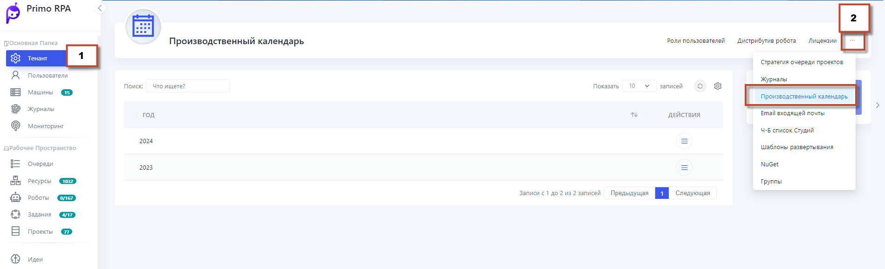

## Производственный календарь

В разделе **Производственный календарь**, вы можете создать производственные календари на текущий и следующий год.

Чтобы добавить новый календарь:
1. Нажмите на опцию **Добавить календарь**.
2. Настройте параметры, включая определение рабочих и выходных дней, а также предпраздничных дней.
3. После настройки сохраните изменения.
