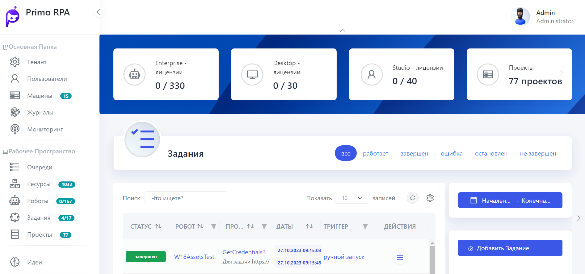
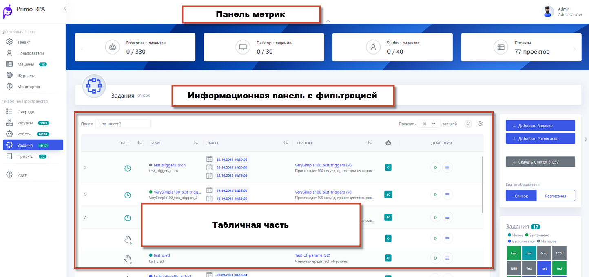
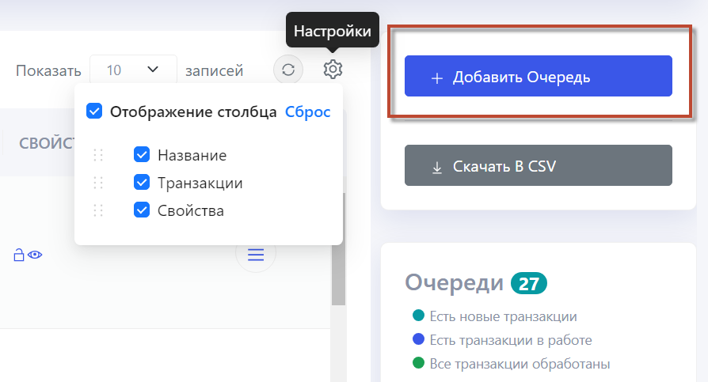
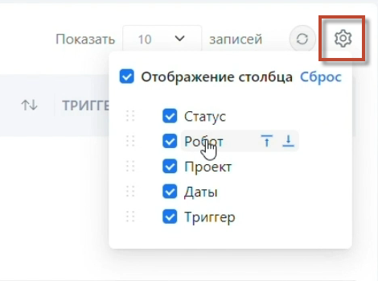

# Hope UI

Hope UI – это новый интерфейс Primo RPA Orchestrator, результат постоянной работы над улучшением и совершенствованием платформы Primo RPA. 

Предлагаем ознакомиться с интерфейсом Hope UI и надеемся, что он повысит комфорт от взаимодействия с Оркестратором.

В дополнение к основным функциям, веб-интерфейс Оркестратора  предлагает ряд расширенных опций, включая процессы:

* [Получения лицензии](https://github.com/PrimoRPA/Docs.Rus/blob/main/orchestrator-hope-ui/get_licenses.md), 
* [Управление ролями](https://github.com/PrimoRPA/Docs.Rus/blob/main/orchestrator-hope-ui/User_role_managment.md) и 
* [Дистрибутивами роботов](https://github.com/PrimoRPA/Docs.Rus/blob/main/orchestrator-hope-ui/robot_distribution_management.md), 
* [Настройку производственного календаря](https://github.com/PrimoRPA/Docs.Rus/blob/main/orchestrator-hope-ui/production_calendar.md), 
* [Использование шаблонов развертывания](https://github.com/PrimoRPA/Docs.Rus/blob/SiuzanaTedzhoeva-HopeUI/orchestrator-hope-ui/template.md), а также комплексное 
* [Управление пользователями](https://github.com/PrimoRPA/Docs.Rus/blob/SiuzanaTedzhoeva-HopeUI/orchestrator-hope-ui/add_user.md) и 
* [Машинами](https://github.com/PrimoRPA/Docs.Rus/blob/SiuzanaTedzhoeva-HopeUI/orchestrator-hope-ui/add_mashine.md). 

## Полезные источники

Видеообзор нового интерфейса доступен по [ссылке](https://www.youtube.com/watch?v=SlxgjXDrvsM).

## Начало работы с Hope UI

**Основное меню**: На левой стороне экрана располагается основное меню для быстрой навигации между разделами.

**Панель метрик**: Сверху по центру размещена панель метрик для мониторинга.

**Информационная панель с фильтрацией**: Ниже находится информационная панель с возможностью настройки фильтров. Слева отображается название текущей страницы, а справа - табы фильтров, выпадающие списки и кнопки-табы для удобной настройки данных.

**Функциональные кнопки**: В правой части экрана расположен блок функциональных кнопок, которые позволяют управлять табличными данными в центре страницы.

**Управление столбцами**: Важной новой функцией табличной части является возможность управления столбцами. Теперь вы можете свободно перемещать и скрывать столбцы, настраивая отображение данных под свои потребности. Вы также имеете возможность сбросить форматирование таблицы на стандартные настройки.

Перейдем к разделу [**Настройка интерфейса**](https://github.com/PrimoRPA/Docs.Rus/blob/SiuzanaTedzhoeva-HopeUI/orchestrator-hope-ui/interface_settings.md), чтобы адаптировать интерфейс под ваши требования.

