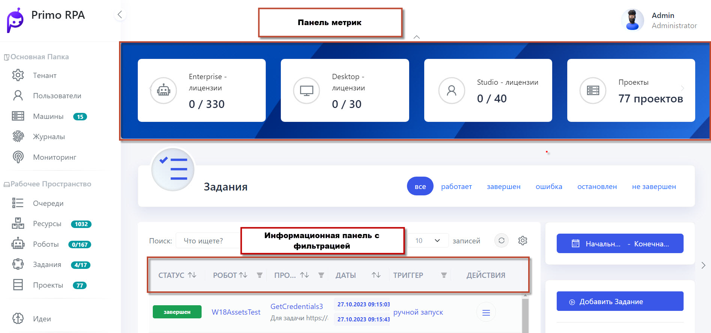

# Hope UI

Hope UI – это новый интерфейс Primo RPA Orchestrator, результат постоянной работы над улучшением и совершенствованием платформы Primo RPA. 

Предлагаем ознакомиться с интерфейсом Hope UI и надеемся, что он повысит комфорт от взаимодействия с Оркестратором.

## Полезные источники

Видеообзор нового интерфейса доступен по [ссылке](https://www.youtube.com/watch?v=SlxgjXDrvsM).

## Начало работы с Hope UI

**Основное меню**: На левой стороне экрана располагается основное меню для быстрой навигации между разделами.

**Панель метрик**: Сверху по центру размещена панель метрик для мониторинга.

**Информационная панель с фильтрацией**: Ниже находится информационная панель с возможностью настройки фильтров. Слева отображается название текущей страницы, а справа - табы фильтров, выпадающие списки и кнопки-табы для удобной настройки данных.

**Функциональные кнопки**: В правой части экрана расположен блок функциональных кнопок, которые позволяют управлять табличными данными в центре страницы.

**Управление столбцами**: Важной новой функцией табличной части является возможность управления столбцами. Теперь вы можете свободно перемещать и скрывать столбцы, настраивая отображение данных под свои потребности. Вы также имеете возможность сбросить форматирование таблицы на стандартные настройки.

Чтобы начать использовать Оркестратор в новом интерфейсе, следуйте шагам:

1. Установите Primo RPA Ochestrator.

2. Перейдите в меню **Настройки > Лицензии** и установите лицензии.

3. Создайте запросы на выдачу лицензий для Студии, Роботов и Оркестратора. Укажите продукт, количество лицензий и срок действия (например, три месяца для Студии).

4. Сохраните запросы и отправьте их в Primo RPA. В ответ получите файлы лицензии.

5. Последовательно загрузите полученные лицензии в Оркестратор.

После выполнения этих шагов можно успешно использовать Оркестратор в новом интерфейсе, видеть сроки действия лицензий и текущее их состояние.
