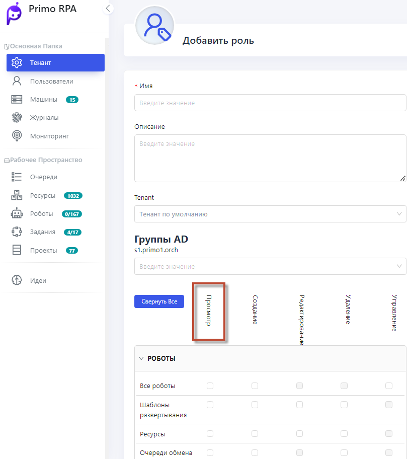

# Управление ролями пользователей

Новый интерфейс Оркестратора предоставляет возможность ограничивать доступ пользователей, наделяя их правами только на просмотр данных. Эта цель достигается путем создания специальных ролей и настройки соответствующих прав.

## Создание и настройка роли

1. Перейдите в раздел **Роли пользователей**.
2. Создайте новую роль, например, **Роль для просмотра**.
3. Назначьте этой роли список прав, которые позволят только просматривать данные.
4. Примените роль к конкретному пользователю, ограничив его доступ. Теперь выбранный пользователь сможет только просматривать информацию в Оркестраторе, без возможности внесения изменений.
   
Подробнее в [видео](https://www.youtube.com/watch?v=SlxgjXDrvsM&t=174s)

