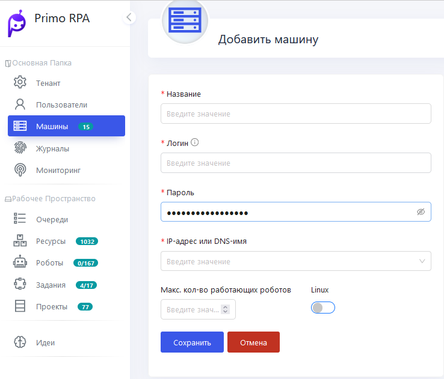

# Добавить машину

Перейдите в раздел **Машины** и следуйте инструкции ниже.

  

1. **Добавление новой машины**:
   - Нажимаем кнопку **Добавить машину**.
   - Называем машину (например, Vicktor) и проверяем её доступность в сети.

3. **Обновление статуса машины**:
   - Нажимаем **Обновить** для проверки статуса. Если машина недоступна, это может быть связано с отсутствием установленного Агента.
   - Также рекомендуем предварительно ознакомиться с «Руководством по настройке машины Робота.docx» из комплекта поставки.

4. **Установка Агента**:
   - Переходим на машину, где будет установлен Агент.
   - Копируем в папку на машине два архива: `Agent` и `AgentInstaller`.
   - Создаем папку в корне диска `C` с названием **Primo**.
   - Распаковываем архивы агента в папку **Primo**.

5. **Настройка Агента**:
   - Обращаемся к документации по установке Агента.
   - Если PowerShell не установлен, сначала устанавливаем его.
   - Возвращаемся в папку с AgentInstaller и продолжаем установку, следуя указаниям из видео https://youtu.be/SlxgjXDrvsM?t=599..
   - Создаем переменную окружения для продуктивной среды через PowerShell, вставляя скопированный скрипт.
   - Создаем службу Агента, вставляя соответствующий скрипт в PowerShell и проверяем ее создание.

6. **Конфигурация и запуск**:
   - Конфигурируем файл appsettings.prod.json, указывая текущий адрес Оркестратора.
   - Сохраняем изменения в файле.
   - Добавляем необходимые порты в фаервол, копируя и вставляя скрипты в PowerShell.
   - Запускаем сервис агента.

7. **Проверка подключения и завершение настройки**:
   - Открываем браузер и проверяем, подключилась ли машина к Оркестратору.
   - Создаем задачу для удержания RDP-сессии, копируя файл `console.bat` в корень диска `C` из комплекта поставки Оркестратора.
   - Импортируем задачу с именем RDP Disconnector из пакета поставки Оркестратора в Task Viewer.

Теперь настройка машины полностью завершена. Если у вас возникли какие-либо трудности, ознакомьтесь с [видеоинструкцией](https://youtu.be/SlxgjXDrvsM?t=599).
