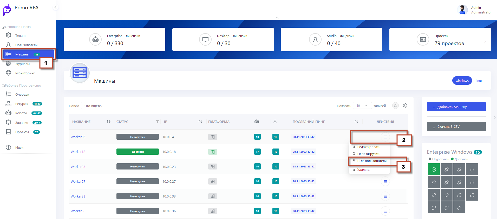
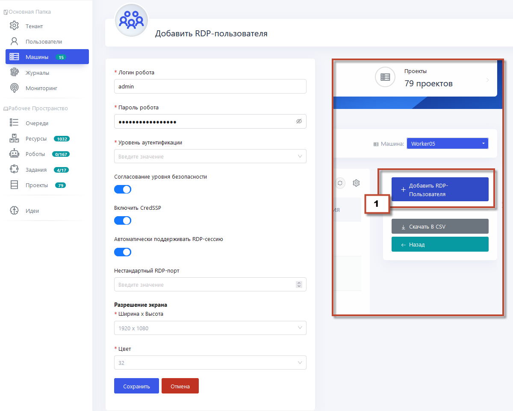
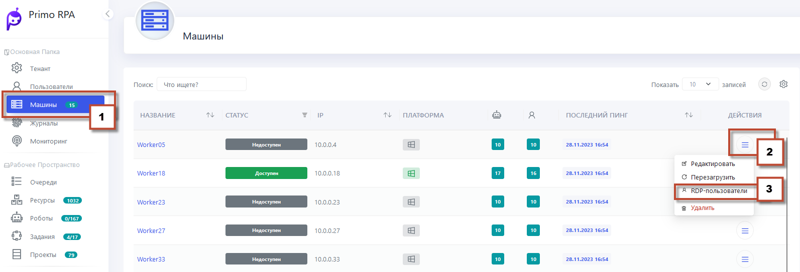
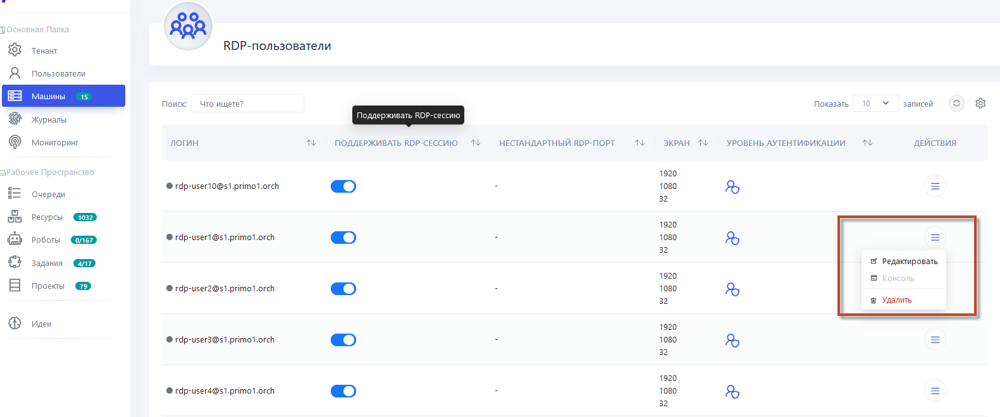

# Регистрация RDP-пользователей на машине робота

RDP-пользователей, созданных в AD или локально на машине робота, можно зарегистрировать в Оркестраторе. Регистрацию выполняет администратор или администратор тенанта.

Для этого необходимо перейти в раздел **Машины роботов**, в поле с названием машины нажать кнопку контекстного меню и в появившемся окне выбрать **RDP-пользователи**



На открывшейся странице нажмите кнопку **Добавить RDP-пользователя** и заполните форму. 



## Видеотрансляция RDP-сессии в Оркестраторе

В интерфейсе Оркестратора пимеется возможность просмотра активной RDP-сессии в реальном времени, позволяя наблюдать за работой роботов. 

Для открытия консоли необходимо:

- Открыть раздел **Машины роботов** и выбрать интересующую машину.
- Затем перейти к списку всех RDP-пользователей, нажав на соответствующую кнопку **RDP-пользователи**.
- В столбце **Действия** нажать кнопку контекстного меню, после чего нажать **Консоль**, чтобы начать трансляцию.
  
**Обратите внимание:** кнопка доступна только если RDP-сессия активна.
- После нажатия откроется окно с видеотрансляцией выбранной RDP-сессии

 
  

  
  

  
## Устранение проблем с Видеотрансляцией RDP-сессии

Если при попытке просмотра видеотрансляции RDP-сессии через вкладку Консоль на странице Робота появляется темный экран, рекомендуем:

1. Сначала  обновить страницу в браузере, чтобы исключить временную ошибку загрузки.

2. Если проблема не устранена, следующим шагом является проверка конфигурационных файлов для работы службы RDP2 и видеотрансляции.

Ниже пример работающих конфигураций:


```
worker_processes 4;

events { worker_connections 1024; }

http {
  sendfile on;
  client_max_body_size 1000m;
 
  upstream app_server {
    server localhost:5001;
  }

  upstream robotlogs {
    server localhost:56748;
  }
  
  upstream rdpstream {
    server orch:5102;
  }

  include mime.types;
  include conf.d/*.conf;

  server {
    listen 44392 ssl;
    ssl_certificate cert1.crt;
    ssl_certificate_key cert1.rsa;
    root html;
    index index.html;
    server_name _;
    client_max_body_size 500m;

    location / {
      try_files $uri /index.html;
    }

    error_log C:/Primo/nginx-1.21.1/logs/my_error.log warn;
   
    location ~* ^/api/robotlogs {
      if ($request_method = POST ) {
         proxy_pass http://robotlogs;         
      }
      if ($request_method = GET ) {
         proxy_pass http://app_server;         
      }
      proxy_set_header Host $host;
      proxy_set_header X-Real-IP $remote_addr;
      proxy_set_header X-Forwarded-For $proxy_add_x_forwarded_for;
      proxy_set_header X-Forwarded-Proto https;
    }
   
    location /api/ {
      client_max_body_size 500m;
      proxy_pass http://app_server;
      proxy_set_header Host $host;
      proxy_set_header X-Real-IP $remote_addr;
      proxy_set_header X-Forwarded-For $proxy_add_x_forwarded_for;
      proxy_set_header X-Forwarded-Proto https;
    }

    location /events {
      proxy_pass http://app_server;
      proxy_http_version 1.1;
      proxy_set_header Upgrade $http_upgrade;
      proxy_set_header Connection "upgrade";
      proxy_set_header Host $host;
      proxy_cache_bypass $http_upgrade;
    }

    location /rdpstream/ {
      proxy_pass https://rdpstream;
      proxy_set_header Host $host;
      #proxy_set_header X-Real-IP $remote_addr;
      proxy_set_header X-Forwarded-For $proxy_add_x_forwarded_for;
      proxy_set_header X-Forwarded-Proto https;
      rewrite  ^/rdpstream/(.*)  /$1 break;
    }
  }
}
```
## WebApi Конфигурация
```
{
    "RdpBaseUrl": "https://orch:44392/rdpstream",
    "RdpBaseUrls": {}

```
## RDP2 Конфигурация
```
  "EnabledOrigins": [
    "https://orch:44392"
  ],
  "ConfigPasswordEncryptorAlgorithm": "AES",
  "Orchestrator": {
    "UserName": "rdpservice",
    "Password": "JLWIyl1xZNDVVx8tcVllOg==",
    "BaseUrl": "https://orch:44392"
  },
```
## Важные Замечания
- Напоминаем, что во время трансляции запись видео не ведется.
- Убедитесь, что параметры в конфигурационных файлах WebApi и службы RDP2 настроены правильно, так как они отвечают за передачу видеотрансляции.
- В случае неполадок с получением видео, рекомендуется обратиться к администратору системы для проверки и корректировки конфигурационных настроек.


