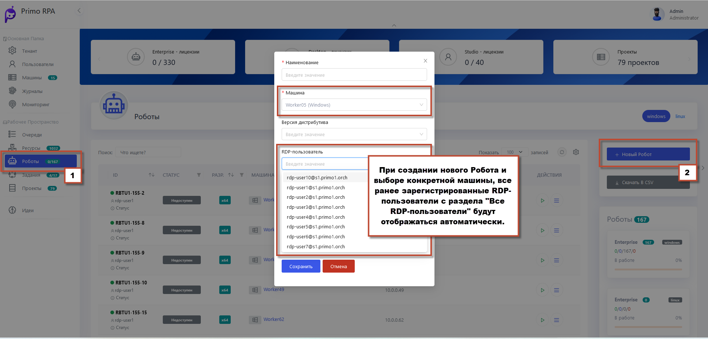

# Регистрация RDP-пользователей на машине робота

Пользователи RDP, созданные в **Active Directory** или локально на компьютере робота, могут быть добавлены в Оркестратор. Этот процесс регистрации осуществляется администратором или администратором тенанта.

Для добавления нового **RDP-пользователя** выполните следующие шаги:

1. Перейдите в раздел **Машины роботов**, в поле с названием **Машины** нажмите кнопку контекстного меню и в появившемся окне выберите **RDP-пользователи**


2. На открывшейся странице нажмите кнопку **Добавить RDP-пользователя** и заполните форму. 


3. Проверьте, что RDP-сессия активна (индикатор становится зеленым).


## Привязка RDP-пользователя к Роботу

 Когда RDP-пользователи добавлены, они могут быть назначены конкретным Роботам. 
 
1. В разделе **Роботы** выберите существующего Робота или создайте нового, нажав **Новый Робот**
2. Заполните поля, указав **Машину**
3. В поле выбора RDP-пользователей выберите одного из ранее добавленных пользователей.

 

4. Сохраните настройки

Каждый робот работает в отдельной RDP-сессии. Оркестратор автоматически управляет открытием и закрытием RDP-сессий для каждого привязанного пользователя.

## Примечания

1. Сессии закрываются автоматически после завершения выполнения проекта роботами, если при добавлении проекта активирована опция **Закрыть RDP-сессию**

2. В настройках RDP-пользователя установите **Поддерживать RDP-сессию**, чтобы сессия оставалась активной независимо от задач робота.

3. **Обратите внимание**, что опция "Закрыть RDP-сессию" имеет приоритет над **Поддерживать RDP-сессию**. Если опция **Закрыть RDP-сессию** активирована, то RDP - сессия будет закрыта по завершении проекта.

## Видеотрансляция RDP-сессии в Оркестраторе

В интерфейсе Оркестратора имеется возможность просмотра активной RDP-сессии в реальном времени, позволяя наблюдать за работой роботов. 

Для открытия консоли выполните следующие шаги:

1. Откройте раздел **Машины роботов** и выберите интересующую машину.
2. Затем перейдите к списку всех RDP-пользователей, нажав на соответствующую кнопку **RDP-пользователи**.
3. В столбце **Действия** нажмите кнопку контекстного меню, затем нажмите **Консоль**, чтобы начать трансляцию.
  
**Обратите внимание:** кнопка доступна только если RDP-сессия активна.
- После нажатия откроется окно с видеотрансляцией выбранной RDP-сессии

 
  

  
  

  
## Устранение проблем с Видеотрансляцией RDP-сессии

Если при попытке просмотра видеотрансляции RDP-сессии через вкладку Консоль на странице Робота появляется темный экран, рекомендуем:

1. Обновить страницу в браузере, чтобы исключить временную ошибку загрузки.

2. Если проблема не устранена, следующим шагом является проверка конфигурационных файлов для работы службы RDP2 и видеотрансляции.

Ниже пример работающих конфигураций:


```
worker_processes 4;

events { worker_connections 1024; }

http {
  sendfile on;
  client_max_body_size 1000m;
 
  upstream app_server {
    server localhost:5001;
  }

  upstream robotlogs {
    server localhost:56748;
  }
  
  upstream rdpstream {
    server orch:5102;
  }

  include mime.types;
  include conf.d/*.conf;

  server {
    listen 44392 ssl;
    ssl_certificate cert1.crt;
    ssl_certificate_key cert1.rsa;
    root html;
    index index.html;
    server_name _;
    client_max_body_size 500m;

    location / {
      try_files $uri /index.html;
    }

    error_log C:/Primo/nginx-1.21.1/logs/my_error.log warn;
   
    location ~* ^/api/robotlogs {
      if ($request_method = POST ) {
         proxy_pass http://robotlogs;         
      }
      if ($request_method = GET ) {
         proxy_pass http://app_server;         
      }
      proxy_set_header Host $host;
      proxy_set_header X-Real-IP $remote_addr;
      proxy_set_header X-Forwarded-For $proxy_add_x_forwarded_for;
      proxy_set_header X-Forwarded-Proto https;
    }
   
    location /api/ {
      client_max_body_size 500m;
      proxy_pass http://app_server;
      proxy_set_header Host $host;
      proxy_set_header X-Real-IP $remote_addr;
      proxy_set_header X-Forwarded-For $proxy_add_x_forwarded_for;
      proxy_set_header X-Forwarded-Proto https;
    }

    location /events {
      proxy_pass http://app_server;
      proxy_http_version 1.1;
      proxy_set_header Upgrade $http_upgrade;
      proxy_set_header Connection "upgrade";
      proxy_set_header Host $host;
      proxy_cache_bypass $http_upgrade;
    }

    location /rdpstream/ {
      proxy_pass https://rdpstream;
      proxy_set_header Host $host;
      #proxy_set_header X-Real-IP $remote_addr;
      proxy_set_header X-Forwarded-For $proxy_add_x_forwarded_for;
      proxy_set_header X-Forwarded-Proto https;
      rewrite  ^/rdpstream/(.*)  /$1 break;
    }
  }
}
```
## WebApi Конфигурация
```
{
    "RdpBaseUrl": "https://orch:44392/rdpstream",
    "RdpBaseUrls": {}

```
## RDP2 Конфигурация
```
  "EnabledOrigins": [
    "https://orch:44392"
  ],
  "ConfigPasswordEncryptorAlgorithm": "AES",
  "Orchestrator": {
    "UserName": "rdpservice",
    "Password": "JLWIyl1xZNDVVx8tcVllOg==",
    "BaseUrl": "https://orch:44392"
  },
```
## Важные Замечания
- Напоминаем, что во время трансляции запись видео не ведется.
- Убедитесь, что параметры в конфигурационных файлах WebApi и службы RDP2 настроены правильно, так как они отвечают за передачу видеотрансляции.
- В случае неполадок с получением видео, рекомендуется обратиться к администратору системы для проверки и корректировки конфигурационных настроек.


