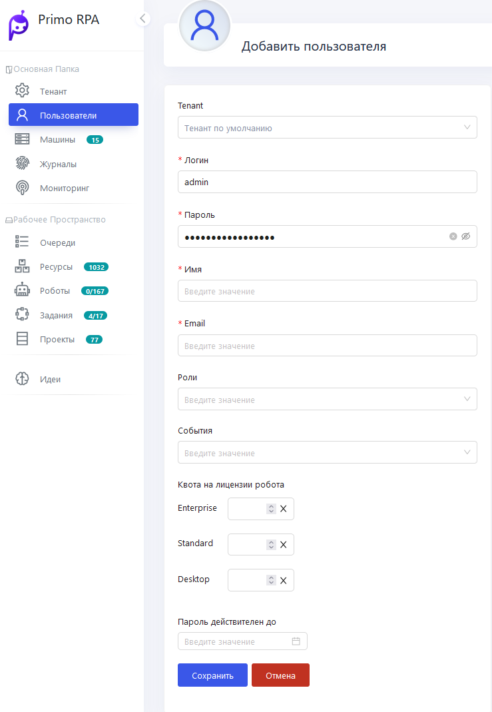
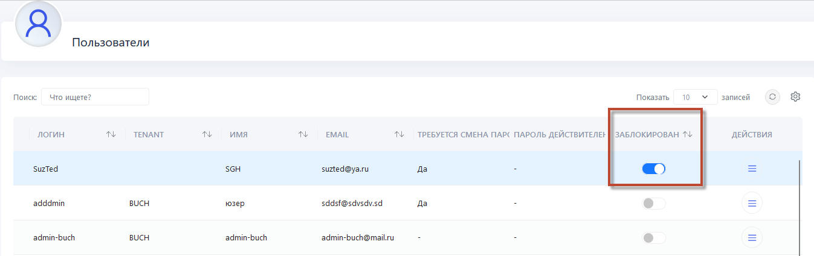

# Добавить пользователя

В Оркестраторе создание пользователя служит для настройки индивидуального доступа к автоматизированным рабочим процессам и для обеспечения безопасности системы. 
Это позволяет управлять ролями и правами доступа каждого пользователя, гарантируя, что каждый имеет доступ только к тем ресурсам и задачам, которые соответствуют его роли в организации.

###  Раздел **Пользователи**

Для добавления нового Пользователя перейдите в раздел **Пользователи** в Веб-интерфейсе Оркестратора

1. Нажмите на кнопку **Добавить пользователя**, чтобы открыть соответствующую форму.
2. Введите данные:
  **Имя пользователя**: Введите уникальное имя для нового пользователя.
  **Пароль**: Задайте надежный пароль. 
  **Личные данные**: Укажите настоящее имя пользователя и его электронную почту.
4. Выберите подходящую **Роль** из списка, определяющую доступ пользователя в системе.
5. Назначьте необходимые события или задачи (возможно установить все события).
6. После заполнения всех полей, нажмите **Сохранить** для завершения процесса добавления пользователя.

### Дополнительные Настройки

 **Блокировка Учетной Записи**
 
Имеется возможность временной блокировки аккаунта пользователя при необходимости

**Настройки Пароля**

Опция позволяет указать обязательность смены пароля при первом входе в систему.

[Посмотреть видео на YouTube](https://youtu.be/SlxgjXDrvsM?t=550)
