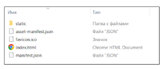
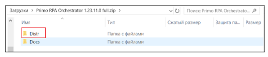
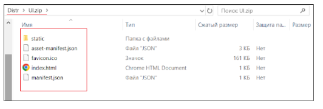

# Возврат к предыдущей версии пользовательского интерфейса Оркестратора

Для возврата к предыдущей версии пользовательского интерфейса Оркестратора выполните следующие действия:  

1. На машине с установленным Оркестратором войдите в папку, в которую были развернуты при установке файлы программы, и найдите папку, в которой у вас расположен UI Оркестратора.  

2. Очистите папку с UI Оркестратора от содержимого. Рекомендуется не удалять содержимое, а сохранить его в другом месте на диске (например, в виде zip архива).  

Содержимое папки UI Оркестратора:  

3. Далее откройте подпапку Distr в папке, куда был загружен дистрибутив Оркестратора.
  

4. В папке Distr найдите файл-архив UI.zip. Откройте его и скопируйте его содержимое в папку UI Оркестратора, подготовленную на шаге 2.

Аналогичным образом может быть произведено переключение в обратном направлении, с предыдущего на новый пользовательский интерфейс. Для этого на шаге 4 вместо файла UI.zip используйте файл UI 3.zip.

