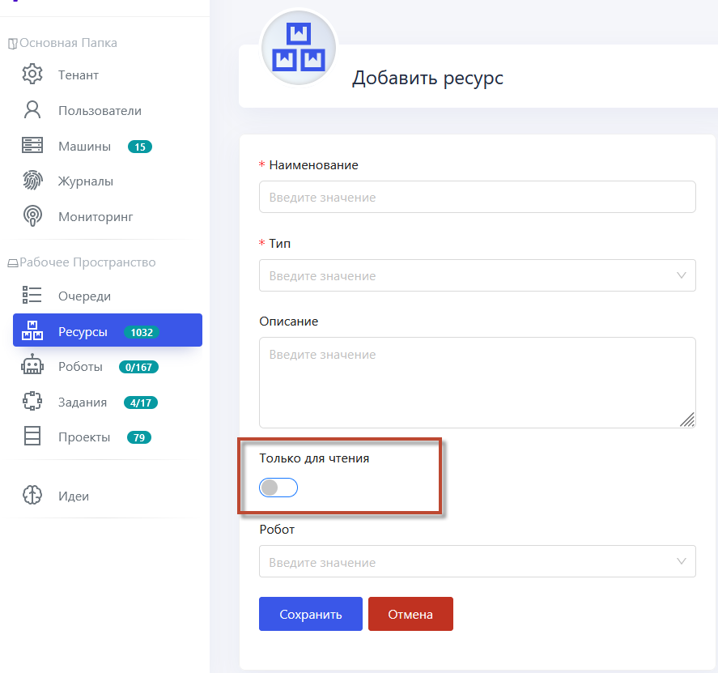
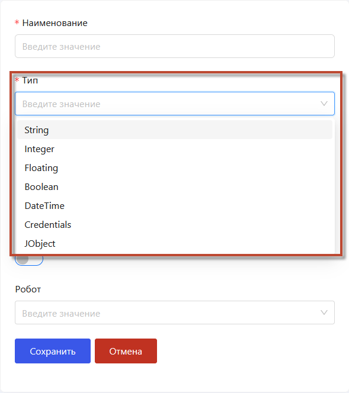
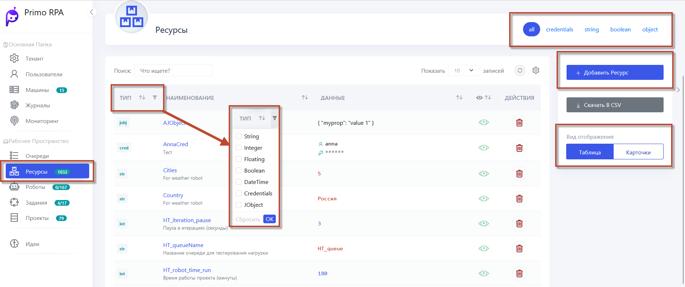

# Ресурсы 

Ресурсы (Assets) представляют собой именованные переменные, которые хранятся в хранилище Оркестратора. Эти переменные служат для хранения и управления различными данными и настройками, необходимыми для выполнения роботами задач автоматизации.  Вот некоторые ключевые аспекты ресурсов в RPA:

Ресурсы могут быть разделены на два основных типа: **глобальные** и **локальные**.

- **Глобальные ресурсы** доступны всем роботам в оркестраторе (в зависимости от настроек прав на чтение и запись). Это означает, что они могут быть использованы несколькими роботами для выполнения задач и обеспечивают централизованный доступ к данным и настройкам.

- **Локальные ресурсы** привязаны к конкретному роботу, и только этот робот имеет доступ к ним. Это обеспечивает изоляцию данных и настроек между разными роботами, что может быть полезно, если требуется ограничить доступ к определенным ресурсам на уровне робота.

Для создания ресурса в Оркестраторе выполните следующие шаги:

1. Перейдите в раздел **Ресурсы**.
2. Нажмите кнопку **Добавить Ресурс**.
3. Заполните параметры формы, выбрав **Тип** данных переменной, например:

   
   - **String** (Строка)
   - **Integer** (Целое число)
   - **Floating** (Дробное число)
   - **Boolean** (Логическое значение)
   - **DateTime** (Дата и время)
   - **Credentials** (Учетные данные)
   - **JObject** (JSON-объект. все типы данных). 

Если выбрано значение **Сredentials**, то будет создан ресурс, хранящий учетные данные пользователя. Пароль хранится в формате SecureString, т.е. в базу данных он попадет в зашифрованном виде и в таком же виде будет передаваться в Студию при помощи элемента [Получить учетные данные](https://docs.primo-rpa.ru/primo-rpa/g_elements/osnovnye-elementy/orkestrator/els_assets/el_orch_getcredentials).

Параметр **Только для чтения** по умолчанию отключен. Если его включить, то значение переменной можно будет только читать в Студии с помощью элемента [Получить значение](https://docs.primo-rpa.ru/primo-rpa/g_elements/osnovnye-elementy/orkestrator/els_assets/el_orch_getvalue).

В поле **Робот** выберите конкретного робота Оркестратора, которому будет доступно использование этого ресурса. Если хотите, чтобы ресурс был глобальным и доступным для всех роботов, оставьте это поле без значения.
  
4. Нажмите **Сохранить**, чтобы обеспечить актуальность данных.

После создания ресурсов в Оркестраторе, вы будете иметь доступ к удобному интерфейсу для управления этими данными.

Подробнее в [видеоинструкции](https://www.youtube.com/watch?v=paXGN7TD_Zk&t=675s) по добавлению ресурсов в Оркестраторе 

