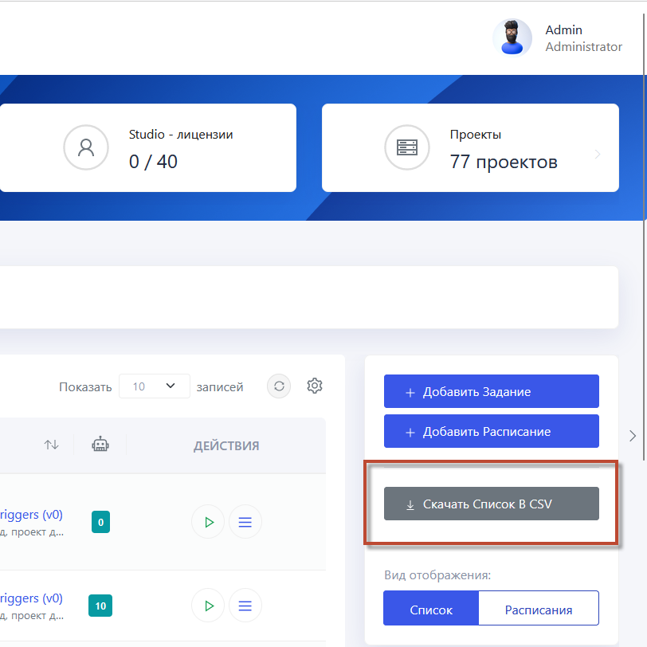

# Экспорт в CSV

Экспорт в CSV представляет собой функцию, позволяющую выгружать данные из системы в формате CSV (Comma-Separated Values). Функция полезна для анализа и отчетности, облегчая принятие эффективных решений. Формат CSV подходит для интеграции с различными системами и для архивации данных на долгий срок.

Для выполнения экспорта в CSV настройте рядом с таблицей данных параметры экспорта, такие как диапазон дат или конкретные поля для включения в CSV-файл. Далее нажмите **Экспорт в CSV**. 

Система сгенерирует файл и предложит его сохранить на вашем устройстве.

