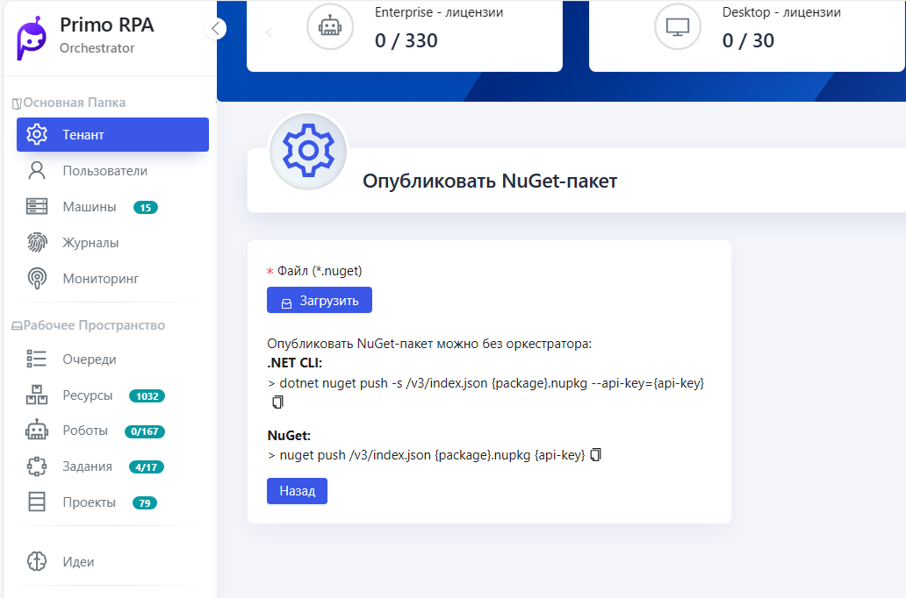
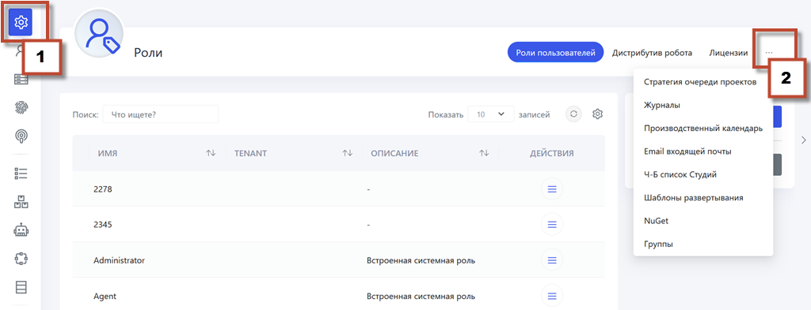

# Настройка интерфейса Hope UI

Интерфейс Оркестратора предоставляет функциональность для скрытия блоков данных (стрелочки) сверху, справа и слева, что позволяет фокусироваться исключительно на табличных данных и повышает концентрацию во время работы.

В интерфейсе Оркестратора доступны дополнительные разделы, которые позволяют настроить различные аспекты системы и управления данными.

Все описанные выше разделы расположены справа в окне интерфейса - **Еще (...)**

## Управление дистрибутивами Роботов

Имеется возможность управлять дистрибутивами роботов, загружая их, назначая основными или удаляя по необходимости. [Подробнее по ссылке ](https://docs.primo-rpa.ru/primo-rpa/orchestrator-hope-ui/tenant/robot_distribution_management)

## Экспорт в CSV

Все табличные данные можно экспортировать в формат CSV для дальнейшего анализа или интеграции в другие системы. 
 [Подробнее по ссылке ](https://docs.primo-rpa.ru/primo-rpa/orchestrator-hope-ui/features/export_to_csv)

## Стратегии очереди проектов

 Эта функция позволяет управлять порядком и приоритетами выполнения проектов в очереди, оптимизируя распределение ресурсов и эффективность обработки задач.
[Подробнее по ссылке ](https://docs.primo-rpa.ru/primo-rpa/orchestrator-hope-ui/tenant/strategy_queue_projects) 

## Журналы

Предназначены для записи и отслеживания всех важных событий и операций в системе, обеспечивая возможность анализа и мониторинга деятельности роботов и процессов.
[Журналы](https://docs.primo-rpa.ru/primo-rpa/orchestrator-hope-ui/tenant/journal_damp)

## Производственный календарь

Используется для планирования и управления рабочими и выходными днями, позволяя настраивать расписание работы роботов в соответствии с производственными потребностями и праздниками.
[Подробнее по ссылке ](https://docs.primo-rpa.ru/primo-rpa/orchestrator-hope-ui/tenant/production_calendar)

## E-mail входящей почты

Функция автоматизирует обработку входящих электронных писем, позволяя настроить правила  для эффективного взаимодействия между роботами и электронной почтой в бизнес-процессах.

## Черно-Белый список Студий

Обеспечивает управление доступом, позволяя определять, какие из машин Студий имеют право на доступ.
[Подробнее](https://docs.primo-rpa.ru/primo-rpa/orchestrator-hope-ui/tenant/black_white_list)

## Шаблон развертывания

Это набор предварительно заданных настроек, который упрощает создание новых роботов или компонентов, так как не нужно каждый раз настраивать параметры заново.
[Подробнее о шаблонах ](https://docs.primo-rpa.ru/primo-rpa/orchestrator-hope-ui/tenant/template)

## NuGet-пакеты

Используются для управления зависимостями  и библиотек. [Пакеты](https://docs.primo-rpa.ru/primo-rpa/orchestrator/settings/nuget) обеспечивают централизованное управление кодом и скриптами, необходимыми для автоматизированных задач. Расположены справа в окне интерфейса - **Еще (...)**

## Группы

Группы в Оркестраторе облегчают управление доступом и правами, позволяя администраторам группировать пользователей и роботов для эффективной настройки разрешений.

Все описанные выше разделы расположены справа в окне интерфейса - **Еще (...)**

