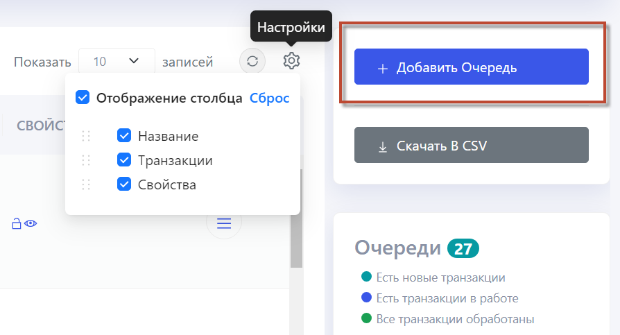

# Hope UI

Hope UI – это новый интерфейс Primo RPA Orchestrator, результат постоянной работы над улучшением и совершенствованием платформы Primo RPA. 

Предлагаем ознакомиться с интерфейсом Hope UI и надеемся, что он повысит комфорт от взаимодействия с Оркестратором.

В дополнение к основным функциям, веб-интерфейс Оркестратора  предлагает ряд расширенных опций, включая такие процессы как:

* [Получение лицензий](https://docs.primo-rpa.ru/primo-rpa/orchestrator-hope-ui/tenant/get_licenses) 
* [Управление ролями](https://docs.primo-rpa.ru/primo-rpa/orchestrator-hope-ui/tenant/user_role_managment) 
* [Управление дистрибутивами роботов](https://docs.primo-rpa.ru/primo-rpa/orchestrator-hope-ui/tenant/robot_distribution_management)
* [Настройка производственного календаря](https://docs.primo-rpa.ru/primo-rpa/orchestrator-hope-ui/tenant/production_calendar)
* [Использование шаблонов развертывания](https://docs.primo-rpa.ru/primo-rpa/orchestrator-hope-ui/tenant/template)
* [Управление пользователями](https://docs.primo-rpa.ru/primo-rpa/orchestrator-hope-ui/start/add_user)
* [Добавление машин Роботов](https://docs.primo-rpa.ru/primo-rpa/orchestrator-hope-ui/start/add_machine)
* [Добавление проекта](https://docs.primo-rpa.ru/primo-rpa/orchestrator-hope-ui/start/add_project)

## Полезные источники

Видеообзор нового интерфейса доступен по [ссылке](https://www.youtube.com/watch?v=SlxgjXDrvsM).

## Начало работы с Hope UI

**Основное меню**: На левой стороне экрана располагается основное меню для быстрой навигации между разделами.

**Панель метрик**: Сверху по центру размещена панель метрик для мониторинга.

**Информационная панель с фильтрацией**: Ниже находится информационная панель с возможностью настройки фильтров. Слева отображается название текущей страницы, а справа - табы фильтров, выпадающие списки и кнопки-табы для удобной настройки данных.

**Функциональные кнопки**: В правой части экрана расположен блок функциональных кнопок, которые позволяют управлять табличными данными в центре страницы.

**Управление столбцами**: Важной новой функцией табличной части является возможность управления столбцами. Теперь вы можете свободно перемещать и скрывать столбцы, настраивая отображение данных под свои потребности. Вы также имеете возможность сбросить форматирование таблицы на стандартные настройки.

Перейдем к разделу [**Настройка интерфейса**](https://docs.primo-rpa.ru/primo-rpa/orchestrator-hope-ui/features/interface_settings), чтобы адаптировать интерфейс под ваши требования.

