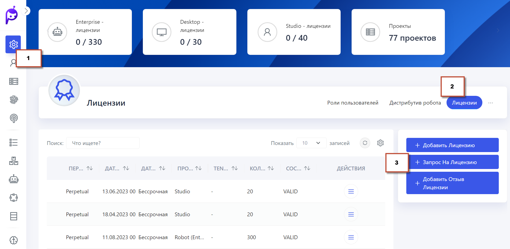
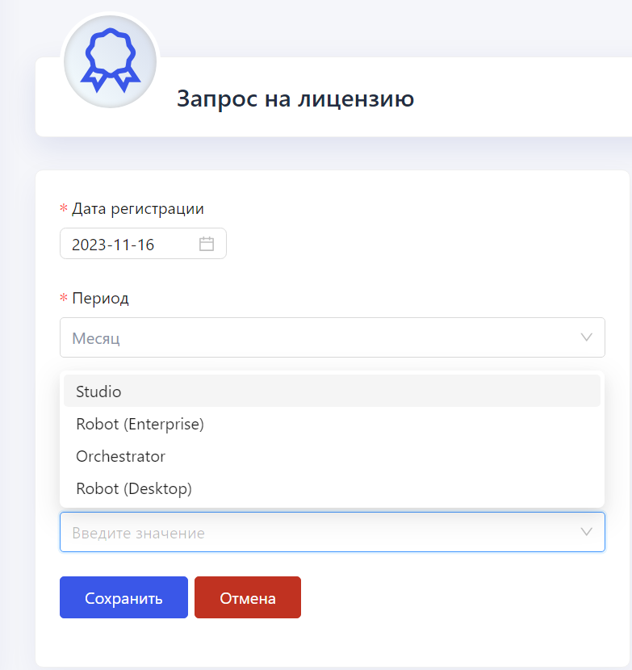
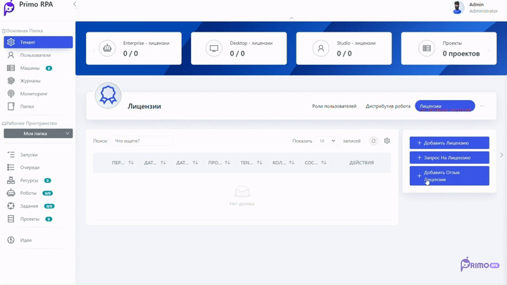

# Получение и управление лицензиями в Primo RPA Orchestrator

Для начала работы выполните следующие шаги:

**Установка Primo RPA Orchestrator:** Установите ПО Primo RPA Orchestrator на вашем устройстве.

 После установки Оркестратора  перейдите в меню **Настройки > Лицензии** в интерфейсе Orchestrator и установите необходимые лицензии.
 

   
   

**Запрос Лицензий:** Создайте запросы на выдачу лицензий для Студии, Роботов и Оркестратора. Укажите тип продукта, количество лицензий и их срок действия (например, на три месяца для Студии).

   
   
   
**Отправка Запросов:** Сохраните созданные запросы и отправьте их в Primo RPA. В ответ вы получите соответствующие файлы лицензий.

**Загрузка Лицензий в Оркестратор:** Последовательно загрузите полученные лицензии в систему Оркестратор.

  

Полная видеоинструкция по добавлению лицензий доступна по [ссылке](https://www.youtube.com/watch?v=SlxgjXDrvsM&t=85s).

**Проверка Статуса Лицензий:** После загрузки лицензий, проверьте их статус в разделе **Лицензии** для подтверждения их активности и действительности.

**Обновление Лицензий:** Регулярно проверяйте сроки действия ваших лицензий и при необходимости обновляйте их, следуя аналогичной процедуре.

**Техническая Поддержка:** В случае вопросов или проблем, связанных с лицензиями, обращайтесь в [**службу поддержки Primo RPA** ](https://t.me/primo_RPA_chat)
