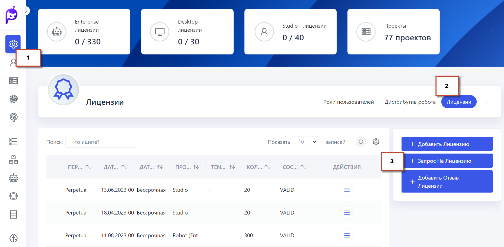
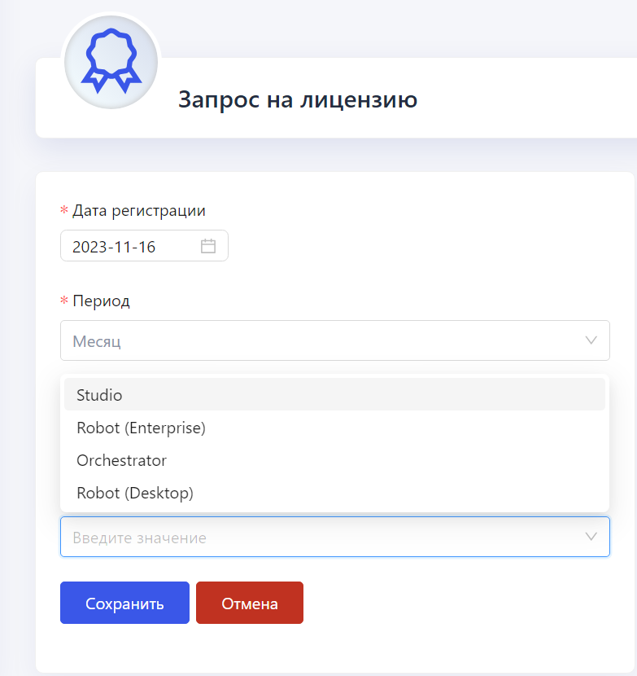

# Управление лицензиями в Primo RPA Orchestrator

Для начала работы выполните следующие шаги:

**Установка Primo RPA Orchestrator:** Установите ПО Primo RPA Orchestrator на вашем устройстве.

 После установки Оркестратора  перейдите в меню **Настройки > Лицензии** в интерфейсе Оркестратора и установите необходимые лицензии.
  и отправляется вендору на эл почту license@primo-rpa.ru. В ответ на запрос, вендор предоставляет файл лицензии с расширением .license (например, `robot.license`).
 

   
   

**Запрос Лицензий:** Это действие открывает форму создания запроса на лицензию, в которой необходимо указать тип лицензии, выбранный из предложенного списка. Создайте запросы на выдачу лицензий для Студии, Роботов и Оркестратора. Укажите тип продукта, количество лицензий и их срок действия (например, на три месяца для Студии). 

   
   
   
**Отправка Запросов:** Далее, сформированный запрос сохраните в текстовый файл (например, `robot.txt`)  и отправьте их вендору Primo RPA  на эл почту license@primo-rpa.ru. В ответ вы получите соответствующие файлы лицензий. 
**Загрузка Лицензий в Оркестратор:** Последовательно загрузите полученные лицензии в систему Оркестратор с помощью кнопки **Добавить лицензию**

  

**Проверка Статуса Лицензий:** После загрузки лицензий, проверьте их статус в разделе **Лицензии** для подтверждения их активности и действительности.
**Обновление Лицензий:** Регулярно проверяйте сроки действия ваших лицензий и при необходимости обновляйте их, следуя аналогичной процедуре.
**Техническая Поддержка:** В случае вопросов или проблем, связанных с лицензиями, обращайтесь в [службу поддержки Primo RPA ](https://t.me/primo_RPA_chat) или напишите на e-mail license@primo-rpa.ru

## Особенности управления лицензиями

- Каждая лицензия по умолчанию выдается на дефолтный тенант. Для назначения лицензии на другой тенант, нужно выделить желаемую лицензию и воспользоваться функцией **Выдать на тенант**.
- Стоит учитывать, что лицензии между тенантами не делятся, и каждый тенант обладает своим набором лицензий.
- Срок действия лицензии отображается с помощью индикатора процента истечения, при этом красный индикатор (100%) указывает на окончание срока действия лицензии.
- В случае смены оборудования БД лицензий (ltoolslicense) Заказчиком, ранее добавленные в Оркестратор лицензии становятся невалидными, и их нужно заменить.

    

## Замена лицензии

Процесс обновления лицензии включает в себя несколько шагов:

1. Отзыв существующей лицензии: Прежде чем произойдет замена, текущую лицензию необходимо аннулировать. Заказчик должен отправить запрос вендору на e-mail license@primo-rpa.ru с указанием лицензии, подлежащей отзыву. Файл существующей лицензии можно скачать в Оркестраторе в разделе Лицензии, даже если действующие лицензии отсутствуют.
2. Формирование и отправка файла отзыва: Вендор, получив запрос, создает файл отзыва лицензии и отправляет его обратно Заказчику.
3. Установка файла отзыва в Оркестраторе: Заказчик должен загрузить полученный файл отзыва в Оркестратор, используя функцию **Добавить отзыв лицензии**. После этого, в интерфейсе Оркестратора лицензия будет помечена как отозванная.
4. Запрос на новую лицензию: При создании нового запроса на лицензию в Оркестраторе, заказчик указывает информацию о ранее отозванной лицензии для ее замены. В результате новая лицензия будет предоставлена Заказчику без дополнительной платы.
