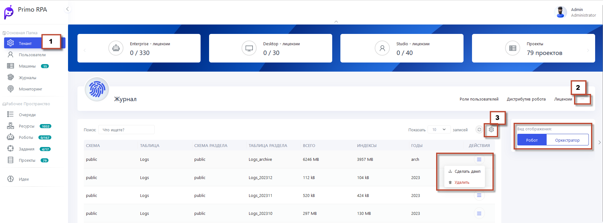

# Журнал
 
 Важной функцией данного раздела является возможность создания дампов журнала событий. Создание дампа позволяет сохранить текущее состояние журнала в виде снимка, что может быть полезно для анализа или архивирования данных.

