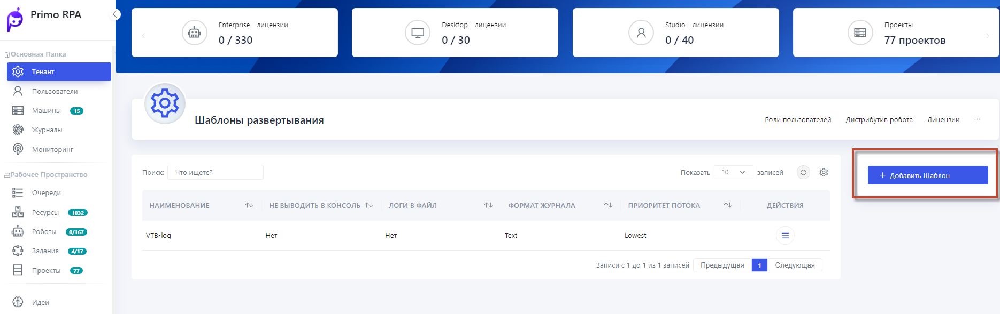

## Настройка интерфейса HOPE UI

Интерфейс Оркестратора предоставляет функциональность для скрытия блоков данных (стрелочки) сверху, справа и слева, что позволяет фокусироваться исключительно на табличных данных и повышает концентрацию во время работы.

**Управление дистрибутивами Роботов**: Имеется возможность управлять дистрибутивами роботов, загружая их, назначая основными или удаляя по необходимости.

**Экспорт в CSV**: все табличные данные можно экспортировать в формат CSV для дальнейшего анализа или интеграции в другие системы.

В Оркестраторе доступны дополнительные разделы, такие как **Стратегии очереди проектов**, **Журналы**, **Производственный календарь**, **E-mail входящей почты** и **Черно-Белый Список Студий**, которые позволяют настроить различные аспекты системы и управления данными.

**Производственный календарь**

В разделе "Производственный календарь", вы можете создать производственные календари на текущий и следующий год.
Чтобы добавить новый календарь:
1. Нажмите на опцию **Добавить календарь**.
2. Настройте параметры, включая определение рабочих и выходных дней, а также предпраздничных дней.
3. После настройки сохраните изменения.

**E-mail входящей почты** 

В роботизации процессов электронная почта используется для автоматической передачи информации между роботами и системами, что помогает улучшить эффективность и скорость бизнес-процессов.

**Шаблон развертывания**

Шаблон развертывания - это набор предварительно заданных настроек, который упрощает создание новых роботов или компонентов, так как не нужно каждый раз настраивать параметры заново.
Он содержит в себе все нужные настройки, такие как конфигурация, безопасность и уровень логирования, делая процесс развертывания быстрым и удобным. 

