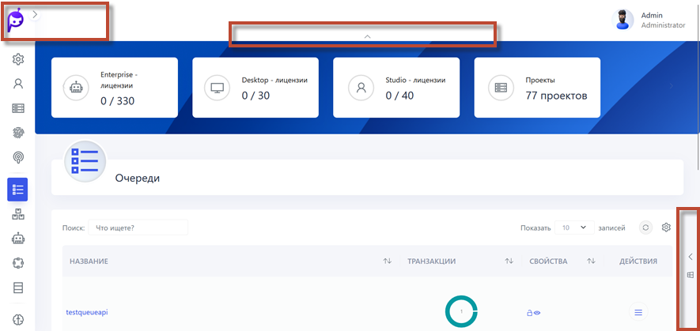

## Настройка интерфейса HOPE UI

Интерфейс Оркестратора предоставляет функциональность для скрытия блоков данных (стрелочки) сверху, справа и слева, что позволяет фокусироваться исключительно на табличных данных и повышает концентрацию во время работы.

В Оркестраторе доступны дополнительные разделы, которые позволяют настроить различные аспекты системы и управления данными.

**Управление дистрибутивами Роботов**: Имеется возможность управлять дистрибутивами роботов, загружая их, назначая основными или удаляя по необходимости.

**Экспорт в CSV**: все табличные данные можно экспортировать в формат CSV для дальнейшего анализа или интеграции в другие системы.

**Стратегии очереди проектов**: Эта функция позволяет управлять порядком и приоритетами выполнения проектов в очереди, оптимизируя распределение ресурсов и эффективность обработки задач.

**Журналы**: Функция предназначена для записи и отслеживания всех важных событий и операций в системе, обеспечивая возможность анализа и мониторинга деятельности роботов и процессов.

**Производственный календарь**: Этот инструмент используется для планирования и управления рабочими и выходными днями, позволяя настраивать расписание работы роботов в соответствии с производственными потребностями и праздниками.

**E-mail входящей почты**: Функция автоматизирует обработку входящих электронных писем, позволяя настроить правила и действия для эффективного взаимодействия между роботами и электронной почтой в бизнес-процессах.

**Черно-Белый Список Студий**: Эта функция обеспечивает управление доступом, позволяя определять, какие студии или сущности имеют право на доступ к определенным ресурсам или операциям, исключая нежелательные взаимодействия.

