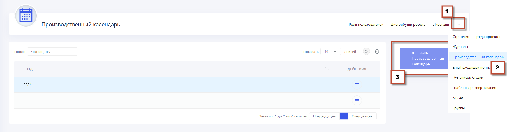
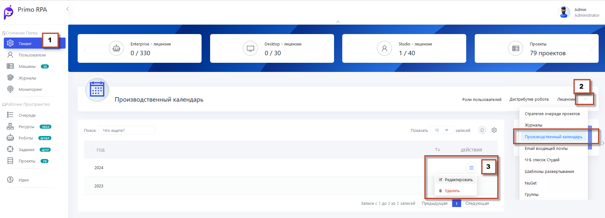
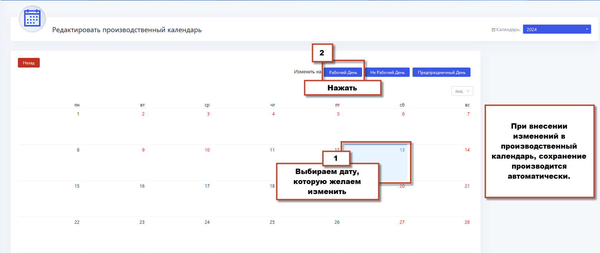

# Производственный календарь

В разделе **Производственный календарь** вы можете создать производственные календари на текущий и следующий год.




Чтобы **Добавить** новый календарь:
1. Нажмите на опцию **Добавить календарь**.
2. Настройте параметры, включая определение рабочих и выходных дней, а также предпраздничных дней.


Чтобы внести изменения - Выбрать календарь - **Отредактировать**:
1. Выбрать день
2. Установить как праздничный/рабочий день
3. Выйти из режима редактирования. Сохранение происходит автоматически







**Множественный режим для производственных календарей**


Существует также множественный режим для производных календарей. Что позволяет создавать несколько производственных календарей на один год. Эта функциональность может быть полезной, например, если организации требуется создать календарь без учета определенных праздничных дней, таких как Новый год. По умолчанию множественный режим отключен.

Чтобы включить **множественный режим**, необходимо внести изменения в конфигурационный файл WebApi. Для этого выполните следующие шаги:

   - Откройте конфигурационный файл WebApi.
   - Найдите секцию **ProductionCalendar**.
   - Установите значение параметра **Multiple** как **true**:

     ```
     "ProductionCalendar": {
         "Multiple": true
     }
     ```

  После внесенных изменений необходимо сохранить конфигурационный файл и перезапустить Службу WebApi.
  Это изменение активирует множественный режим для производственных календарей.

После включения множественного режима можно создавать и управлять несколькими производственными календарями на один год в соответствии с потребностями.
