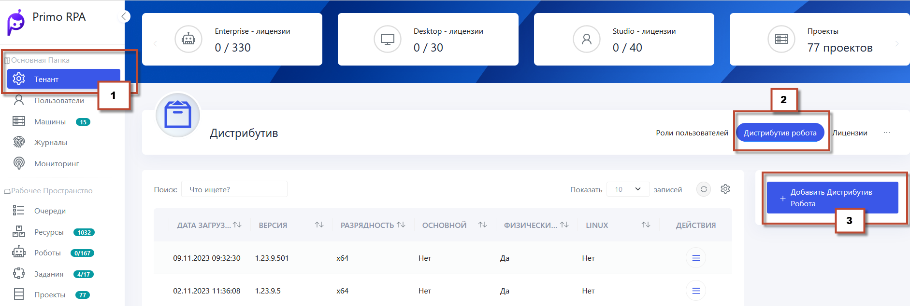

# Управление дистрибутивами роботов

Можно управлять дистрибутивами роботов, загружая их, назначая в качестве основных или удаляя при необходимости.

## Загрузка дистрибутивов Робота

С версии 23.5 дистрибутив робота Orchestrator (или Робот Enterprise) доступен отдельно от основного комплекта поставки. Название дистрибутива должно включать слово Orchestrator, например, Primo.Robot.<архитектура>.Orchestrator<версия>. 
Загрузить дистрибутив можно в разделе **Настройки > Дистрибутивы робота**, нажав на кнопку **Добавить дистрибутив Робота**. Только администраторы имеют права на загрузку.

## Выбор основного дистрибутива

В столбце **Основной** указано, будет ли дистрибутив автоматически использоваться при развертывании Роботов. Чтобы назначить дистрибутив в качестве основного, нужно выбрать соответствующую строку и нажать кнопку **Сделать основным**. Выбранный дистрибутив будет использоваться по умолчанию при развертывании Роботов.

## Разрядность дистрибутивов

 Для операционной системы Windows доступны дистрибутивы  x86 и x64 версии. Для Linux доступны исключительно дистрибутивы x64.

 ## Возможные ошибки при загрузке дистрибутивов
 
1. Дистрибутив Версии не поддерживает push состояния робота
- **Причина**: Несоответствие версий дистрибутива Агента и Оркестратора.
- **Решение**: Проверить и при необходимости обновить версию дистрибутива Оркестратора.

2. Ошибка **permission error** при загрузке дистрибутива
- **Причина**: Учетная запись пользователя не имеет достаточных прав доступа к файловой системе.
- **Решение**: Обратиться к администраторам для получения необходимых прав.

3. Надпись о необходимости загрузки дистрибутивов, хотя они уже загружены
- **Причина**: Сохранение устаревших данных в кэше браузера.
- **Решение**: Очистить кэш браузера или использовать режим Инкогнито.

4. Ошибка **33%** при загрузке дистрибутива робота в Оркестратор
- **Причина**: Отсутствие или некорректная установка PowerShell-7.1.3-win-x64.msi на машинах агента и Оркестратора.
- **Решение**: Установить или переустановить PowerShell-7.1.3-win-x64.msi согласно инструкции и перезапустить Primo.Orchestrator.Agent в Службах.

