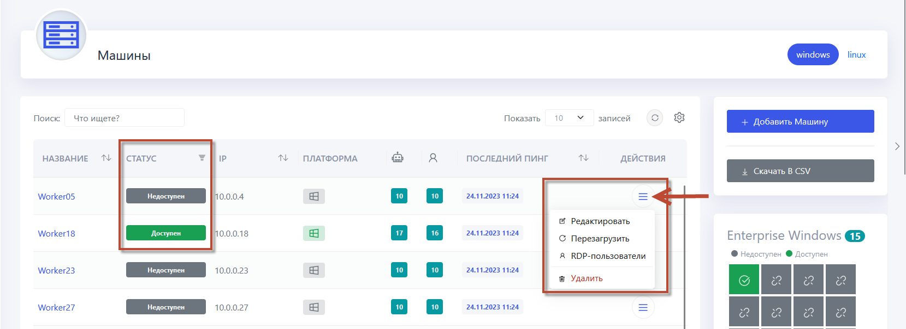

# Добавить машину

Для добавления машины перейдите в раздел **Машины** и следуйте инструкции ниже.

  

**1.** **Добавление новой машины**:
- Нажимите кнопку **Добавить машину**.
- Назовите машину (например, Vicktor) и проверьте её доступность в сети.

**2.** **Обновление статуса машины**:
- Нажимите **Обновить** для проверки статуса. Если машина недоступна, это может быть связано с отсутствием установленного Агента.
- Также рекомендуется предварительно ознакомиться с «Руководством по настройке машины Робота.docx» из комплекта поставки.



**3.** **Установка Агента**:
- Перейдите на машину, где будет установлен Агент.
- Скопируйте в папку на машине два архива: `Agent` и `AgentInstaller`.
- Создайте папку в корне диска **C** с названием **Primo**.
- Распакуйте архивы агента в папку **Primo**.

**4.** **Настройка Агента**:
- Обратитесь к документации по установке Агента.
- Если PowerShell не установлен, сначала установите его.
- Вернитесь в папку с AgentInstaller и продолжайте установку, следуя указаниям из [видео](https://youtu.be/SlxgjXDrvsM?t=599)
- Откройте PowerShell и вставьте следующий скрипт, чтобы создать переменную окружения для продуктивной среды:

   ```powershell
   [System.Environment]::SetEnvironmentVariable('ASPNETCORE_ENVIRONMENT', 'ProdWin', [System.EnvironmentVariableTarget]::Machine)
   ```

- В PowerShell вставьте следующий скрипт для создания службы Агента. Этот скрипт устанавливает имя службы, путь к исполняемому файлу, описание и тип запуска:

   ```powershell
   New-Service -Name "Primo.Orchestrator.Agent" -BinaryPathName "C:\Primo\Agent\Primo.Orchestrator.Agent.exe" -Description "Primo.Orchestrator.Agent" -DisplayName "Primo.Orchestrator.Agent" -StartupType Automatic
   ```


**5.** **Конфигурация и запуск**:
- Отредактируйте конфигурационный файл **appsettings.prod.json**, указывая текущий адрес Оркестратора.
- Сохраните изменения в файле.
- Добавьте необходимые порты в фаервол, копируя и вставляя последовательно скрипты в PowerShell.
  
   ```powershell
   New-NetFirewallRule -Name "Primo Agent (5002)" -DisplayName "Primo Agent (5002)" -Profile "Private, Domain, Public" -Direction Inbound -Action Allow -Protocol TCP -LocalPort 5002
   ```

   ```powershell
   New-NetFirewallRule -Name "Primo Robot (8000-9000)" -DisplayName "Primo Robot (8000-9000)" -Profile "Private, Domain, Public" -Direction Inbound -Action Allow -Protocol TCP -LocalPort 8000-9000
   ```
- Эти скрипты добавят исключения в фаервол, разрешая доступ к указанным портам.
- Запустите сервис агента.


**6.** **Проверка подключения и завершение настройки**:
- Откройте браузер и проверьте, подключилась ли машина к Оркестратору.
- Создайте задачу для удержания RDP-сессии, копируя файл `console.bat` в корень диска `C` из комплекта поставки Оркестратора.
- Импортируйте задачу с именем RDP Disconnector из пакета поставки Оркестратора в Task Viewer.

Теперь настройка машины полностью завершена. Если у вас возникли какие-либо трудности, ознакомьтесь с [видеоинструкцией](https://youtu.be/SlxgjXDrvsM?t=599).
