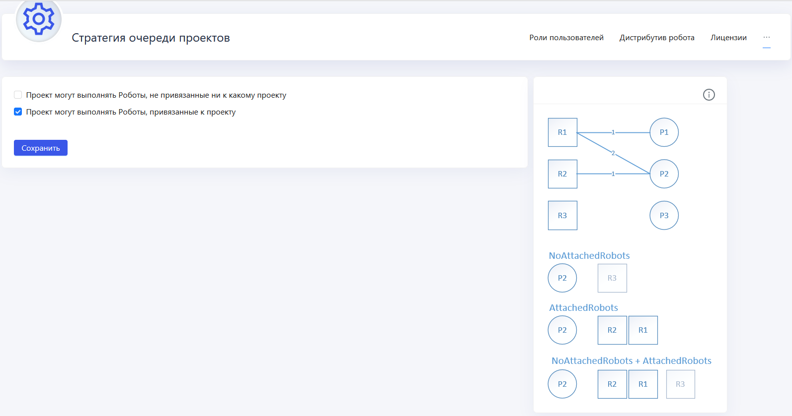
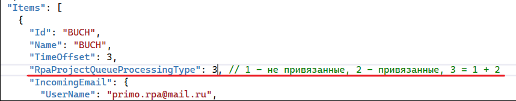

# Стратегия очереди RPA-проектов

Стратегия очереди проектов в **Primo RPA Orchestrator** может быть настроена на двух уровнях: глобальном и индивидуальном для каждого тенанта.

# Глобальная стратегия 

Эта стратегия, настроенная администратором через пользовательский интерфейс (UI) Оркестратора, применяется по умолчанию ко всем тенантам. Она называется глобальной стратегией для дефолтного тенанта.
   
Для глобальной настройки перейдите в **Настройки > Стратегия очереди проектов**. 

Здесь определяется, каким образом роботы будут назначаться на RPA-проекты. Возможные варианты стратегии:

 1. **Роботы, не привязанные к проекту:** Такие роботы могут выполнять любой проект, если свободны.
 2. **Только привязанные роботы:** Роботы, не привязанные к проекту, не могут его выполнять.
 3. **Комбинированная стратегия 1+2:** Сначала рассматриваются привязанные роботы, а затем – непривязанные.
 
# Стратегия для отдельного тенанта (Индивидуальная)

Для настройки индивидуальной стратегии очереди проектов для отдельного тенанта, изменения должны быть внесены непосредственно в конфигурационный файл WebApi. 

   1. В конфигурационном файле WebApi в разделе `Tenants`  выберите нужного тенанта.
   2. Укажите желаемую стратегию в параметре `RpaProjectQueueProcessingType`.
   3. Доступные значения для этого параметра соответствуют параметрам настройки глобальной стратегии в пользовательском интерфейсе Оркестратора.
   4. Если для тенанта не задана индивидуальная стратегия, то по умолчанию будет использоваться глобальная стратегия, настроенная для всех тенантов.
   5. После внесенных изменений обязательно сохранить файл и перезапустить **WebApi** в Службах (Services)

### Пример назначения робота в зависимости от стратегии очереди проектов

Допустим, у нас есть следующая конфигурация роботов и проектов:

- Робот R1 привязан к проектам P1 и P2.
- Робот R2 привязан исключительно к проекту P2.
- Робот R3 не привязан ни к одному проекту.

Теперь рассмотрим сценарий, в котором необходимо выполнить проект P2, и посмотрим, как различные стратегии очереди проектов повлияют на выбор робота для выполнения этого проекта.

1. **Стратегия "Только привязанные Роботы":** В этом случае для выполнения проекта P2 будут рассматриваться только Роботы R1 и R2, так как они привязаны к этому проекту. Робот R3 будет исключен из выбора, поскольку он не привязан к проекту P2.

2. **Стратегия "Только непривязанные Роботы":** Согласно этой стратегии, для выполнения проекта P2 будет рассматриваться только Робот R3, так как он не привязан ни к одному проекту. Роботы R1 и R2, привязанные к другим проектам, не будут рассмотрены.

3. **Комбинированная стратегия 1+2 (привязанные и непривязанные Роботы):** В этом случае система сначала рассмотрит роботов, привязанных к проекту P2, то есть R1 и R2. Если они заняты, система затем рассмотрит непривязанного робота, R3.

# Частые ошибки:

**Ошибка: Нет свободных роботов**: Может возникать, когда все роботы заняты, или настройки роботов ограничивают количество одновременно работающих роботов. Также ошибка может быть связана с неправильной настройкой соединения между Оркестратором и роботом, или отсутствием такового.

**Привязка роботов к проектам**: Если в стратегии очереди выбрана опция "Проект могут выполнять Роботы, привязанные к проекту", и робот не привязан к проекту, это может привести к ошибке выполнения.

**Выполнение проекта на непривязанных Роботах**: Если проект, привязанный к определённому роботу, выполняется на любом свободном роботе, это может указывать на то, что в настройках разрешено выполнение проекта роботами, не привязанными к проекту. Необходимо изменить настройки в разделе Настройки > Стратегия очереди проектов, установив соответствующую опцию.

