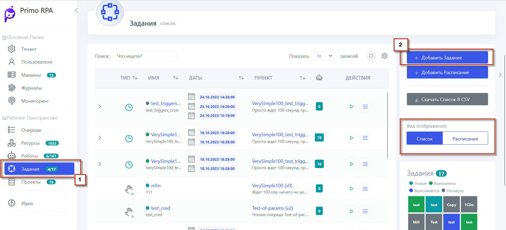
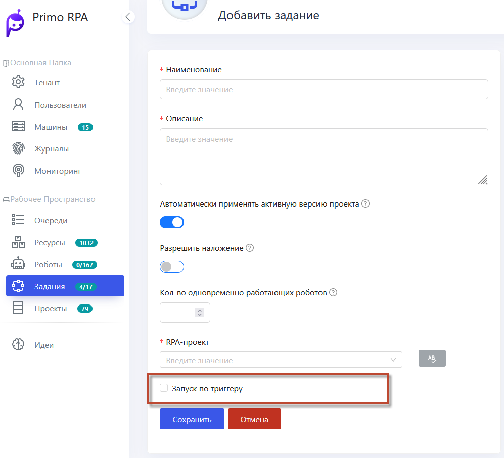
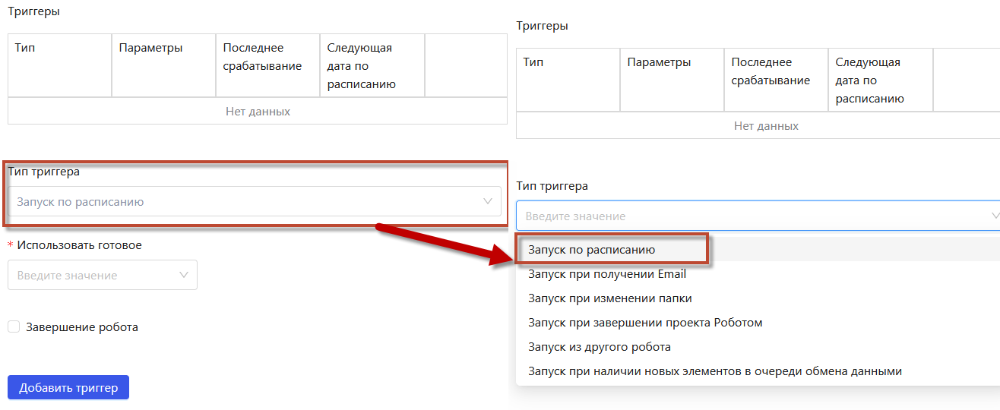
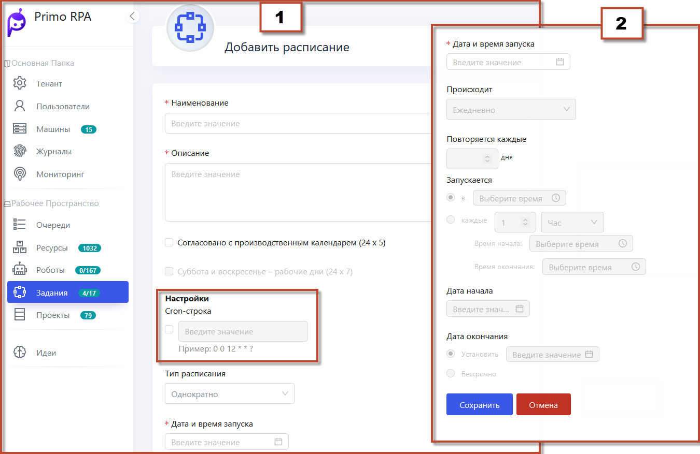
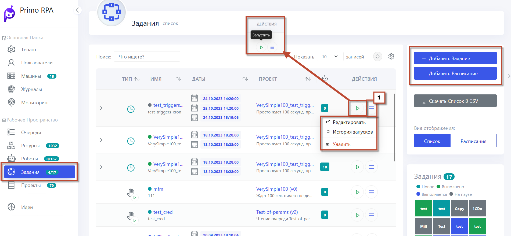

# Задания 

Задания в системе управления проектами представляют собой автоматизированные действия, запускаемые в соответствии с определёнными условиями или расписаниями. Они могут быть настроены для выполнения различных операций, таких как обработка данных, выполнение скриптов или запуск процессов. Задания могут запускаться автоматически по расписанию, заданному через крон строки или инструменты планирования, и могут повторяться с заданной периодичностью. 
Также возможно использование **триггеров**, таких как завершение работы другого проекта или сигнал от другого робота, для инициации задания. Это позволяет создавать гибкие и эффективные автоматизированные рабочие процессы в рамках проектов или операций.

Создание задания может быть выполнено по следующим шагам:

1. Откройте **Задания** в веб-интерфейсе Оркестратора

      
   При заполнении формы задания укажите необходимое описание, чтобы конкретизировать особенности и намерения задания. Если планируется, что задание будет запускаться вручную без автоматического триггера, то установка галочки **Запуск по триггеру** не требуется.
   

   

3. **Настройка Триггера:**
   Установите триггер для активации задания, если это предусмотрено условиями выполнения.
 

 4. **Создание Расписания:**
   - Перейдите в раздел **Задания**.
   - Выберите **Добавить расписание**.
   - Используйте cron-строку для определения частоты или выберите параметры через графический интерфейс.
   - Пример: Установите повторение каждые пять дней, с началом в 12:00 и окончанием в 18:00. Расписание может быть установлено как бессрочное.
   - Нажмите **Сохранить** для активации расписания.

    

2. **Добавление задания к расписанию:**
   - Создайте новое задание.
   - Включите триггер **По расписанию** и выберите созданное расписание.
   - Сохраните задание.
   - Теперь задание будет автоматически запускаться согласно расписанию.

В новом интерфейсе оркестратора пользователи имеют доступ к ряду функций для управления заданиями, что делает процесс более гибким и контролируемым:

 

- **Редактирование заданий:**
  - Пользователи могут изменять параметры уже созданных заданий, включая настройки, условия запуска и другие характеристики.

- **Просмотр истории запусков:**
  - Доступ к подробной истории всех запусков заданий позволяет анализировать их эффективность и определять возможные проблемы.

- **Удаление заданий:**
  - При необходимости можно удалить задания, которые больше не актуальны или требуют замены.

- **Ручной запуск заданий:**
  - Эта функция позволяет запускать задания вручную в любое время, что особенно полезно для тестирования, отладки или выполнения одноразовых задач.

- **Просмотр и управление триггерами задания:**
  - Пользователи могут просматривать и настраивать триггеры для каждого задания, устанавливая условия, при которых задание должно быть запущено или остановлено. 

Подробнее о триггерах можно ознакомиться по ссылке [Триггеры](https://docs.primo-rpa.ru/primo-rpa/orchestrator/basics/tasks)

