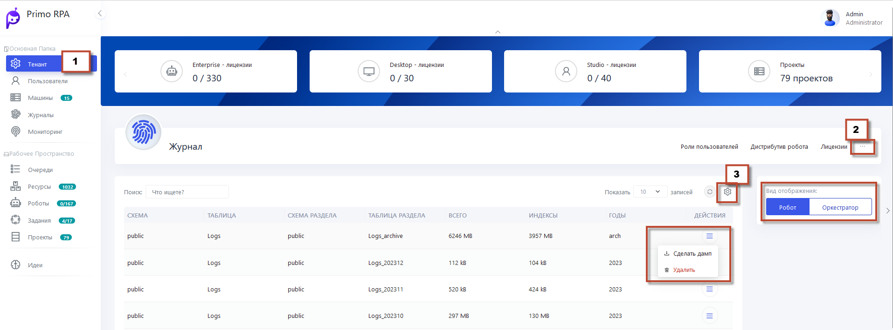
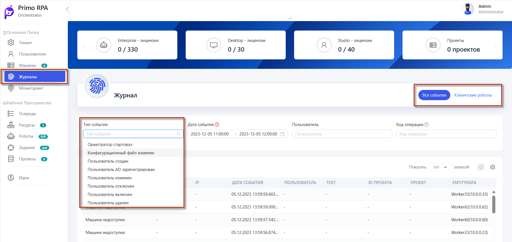

# Журнал
 
 Важной функцией данного раздела является возможность создания дампов журнала событий. Создание дампа позволяет сохранить текущее состояние журнала в виде снимка, что может быть полезно для анализа или архивирования данных.

Журналы событий в системе представляют собой ключевой инструмент для мониторинга и анализа активности. Каждая запись содержит следующие важные колонки и поля:

1. **СОБЫТИЕ**: Описывает тип события, произошедшего в системе.
2. **TENANT**: Указывает на подразделение системы, связанное с событием.
3. **IP**: Показывает IP-адрес, с которого инициировано событие.
4. **ДАТА СОБЫТИЯ**: Фиксирует время происшествия события.
5. **ПОЛЬЗОВАТЕЛЬ**: Отображает пользователя, выполнившего действие.
6. **TEXT**: Предоставляет детальное описание события.
7. **ID ПРОЕКТА**: Уникальный идентификатор проекта, связанного с событием.
8. **ПРОЕКТ**: Название проекта, связанного с событием.
9. **ENTITYDATA**: Содержит дополнительные технические данные о событии.

- **Фильтрация по дате события**: Фильтр  сохраняет последнее использованное значение.

- **Выделение цепочки событий**: Можно выделить цепочку событий операции среди прочих, фильтруя по коду операции.

- **Свод событий Оркестратора**: В Приложении 3 – [ **События Оркестратора**](https://docs.primo-rpa.ru/primo-rpa/orchestrator/appendix/appendix3) представлен полный свод всех событий системы.

 
