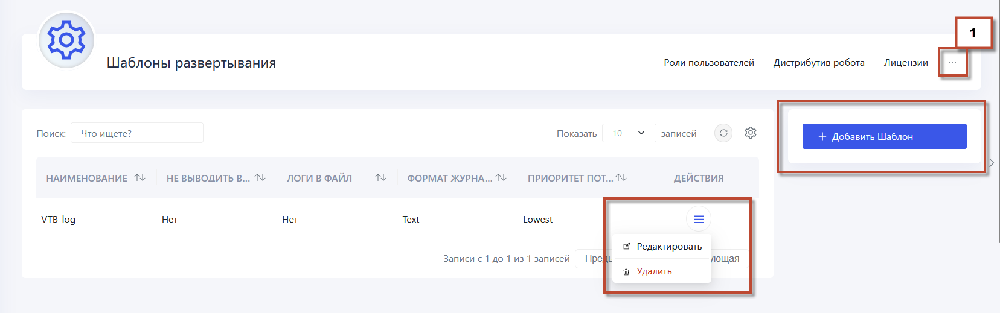
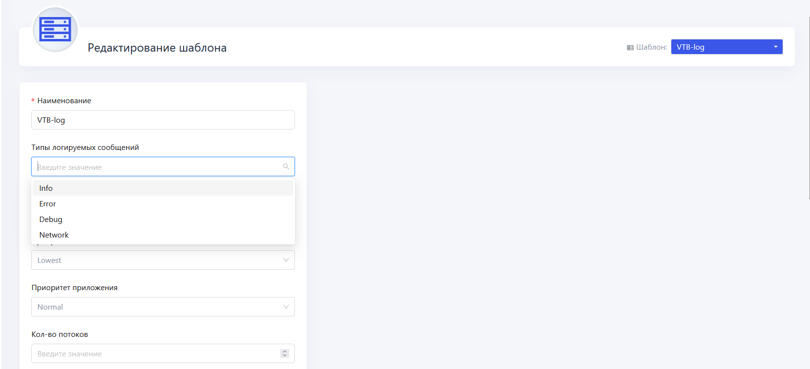
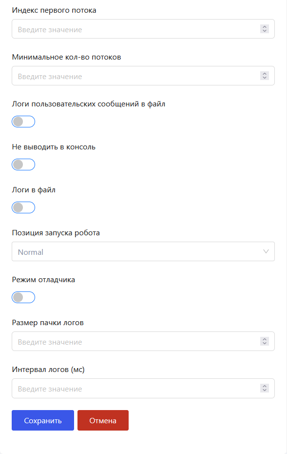

# Шаблон развертывания

Шаблон развертывания – это предварительно настроенный набор параметров и настроек, который используется для упрощения и стандартизации процесса развертывания роботов. Эти шаблоны могут включать конфигурации, связанные с логированием, безопасностью, сетевыми настройками и другими важными аспектами работы роботов.

Для создания шаблона развертывания перейдите в раздел **Настройки ➝ Еще (...)  ➝ Шаблоны развертывания** и нажмите кнопку **Добавить шаблон**:

Настройки потоков позволяют запускать несколько потоков одного проекта. Количество потоков - это количество копий проекта, которые параллельно будут запущены:

Таким образом, будет происходить запуск одного Робота в N потоков в рамках одной сессии. Несмотря на то, что запустится всего один Робот, одновременно будут выполняться несколько экземпляров проекта.

Затем нажимаем **Сохранить**. В Primo RPA Orchestrator возможно использование нескольких шаблонов развертывания.

## Для чего необходим шаблон развертывания?

**Убрать всплывающее окно на удаленной машине при запуске робота через Оркестратор** 

Примените шаблон развертывания, который позволяет сохранить все ранее настроенные параметры:
* Создайте шаблон развертывания для робота.
* Укажите в шаблоне "Позиция запуска робота = Tray", чтобы избежать всплывания окна робота на удаленной машине.
* Переразверните робота с использованием нового шаблона.

**Отключить информационные сообщения (логирование) о событиях робота**

Создайте шаблон развертывания и укажите в нем уровень логирования Debug. Затем переразверните роботов с использованием этого шаблона, чтобы отключить информационные сообщения.

