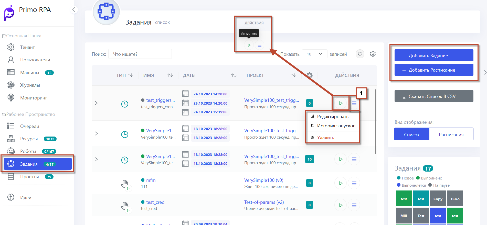

# Триггеры

Триггеры в системе автоматизации RPA играют ключевую роль в запуске проектов. Они создают условия, при которых проекты автоматически начинают выполнение, либо могут быть запущены вручную, если триггер не задан. Вот основные виды триггеров доступные в системе:

### 1. **Запуск по Расписанию**
  Триггер активирует задания по заранее определённому расписанию. Расписание может быть задано через [Cron-строку](https://docs.primo-rpa.ru/primo-rpa/orchestrator/basics/tasks/schedules#1.-cron-stroka) или конструктор.

  Триггер также может использоваться для завершения уже запущенных заданий.

### 2. **Запуск при получении E-mail**
  Триггер срабатывает при получении нового письма в настроенном почтовом ящике. Для его работы необходимо заранее настроить почтовый ящик тенанта.
     

### 3.  **Запуск при изменении папки**

Триггер реагирует на изменения в папке, которая находится под наблюдением, независимо от того, расположена ли она на локальном компьютере, где работает робот, или в сетевом хранилище.

В случае папки на компьютере робота, требуется указать:

- Конкретный компьютер, где работает робот.
- Полный путь к отслеживаемой папке.

Для сетевой папки необходимо предоставить:

- Шаблон фильтра, который определяет критерии отслеживания изменений в папке.
- **UNC-имя папки** для её идентификации в сети.

**UNC (Universal Naming Convention)** – это стандартное обозначение для указания сетевого пути к ресурсу, такому как папка. UNC-имя папки обеспечивает точный путь к её расположению в сети и состоит из имени сервера и пути к папке на этом сервере. Например, UNC-путь к сетевой папке может выглядеть как \\ИмяСервера\Путь к папке.

### 4. **Запуск при завершении проекта Роботом**

  Триггер срабатывает при успешном или ошибочном завершении выполнения проекта каким-либо Роботом.

### 5. **Запуск из другого Робота**

  Триггер активируется при прямом вызове из другого робота. Это позволяет связывать выполнение различных заданий между собой.
   
Запуск задания с использованием триггера **Запуск из другого Робота** происходит следующим образом:
Вначале осуществляется выполнение задания X, в котором содержится специальный элемент **Запустить Робота**. Этот элемент служит для инициирования работы робота по другому заданию, которое мы обозначим как задание **Y**. Для активации задания **Y** необходимо, чтобы у него был установлен триггер **Запуск из другого Робота**. Когда робот приступает к выполнению элемента **Запустить Робота** в рамках задания **X**, он автоматически инициирует запуск задания **Y**.

### 6. **Запуск при наличии новых элементов в Очереди обмена данными**

Триггер активируется при появлении новых элементов в очереди данных при её проверке. Он работает асинхронно с добавлением элементов, и периодичность опроса настраивается пользователем. Основные параметры:
     
- **Выбор очереди данных**: Обязательный параметр, где выбирается название очереди из списка.
- **Периодичность опроса**: Также обязательна, задаётся через [Cron-строку](https://docs.primo-rpa.ru/primo-rpa/orchestrator/basics/tasks/schedules#1.-cron-stroka) или интервал в минутах.
- **Количество новых элементов**: Если задано число N, триггер срабатывает при обнаружении минимум N новых элементов. При отсутствии этого параметра, достаточно наличия хотя бы одного нового элемента.

Для добавления **нескольких триггеров**  выполните следующие шаги: 
 - В Веб-интерфейсе Оркестратора перейдите в раздел **Задания** и выберите **Добавить задание**.
 - Затем установите галочку в  **Запуск по триггеру** и, выбрав нужный триггер, нажмите **Добавить**.
 - Процесс можно повторить, добавляя нужное количество триггеров к заданию.
 - Убедитесь, что триггеры не конфликтуют между собой или с триггерами других заданий. Это гарантирует эффективное выполнение заданий без логических противоречий.

Кроме того, Оркестратор предоставляет возможности для управления заданиями, такие как запуск, остановка, редактирование и отслеживание статуса заданий. Также в некоторых случаях может быть полезной функция [кэширования проекта](https://docs.primo-rpa.ru/primo-rpa/orchestrator/deployment/fine-tuning/project-caching) для ускорения его выполнения.

