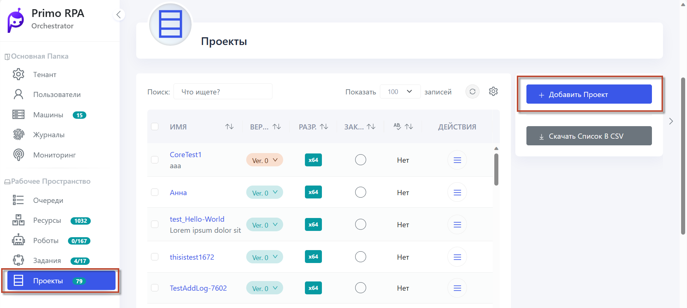
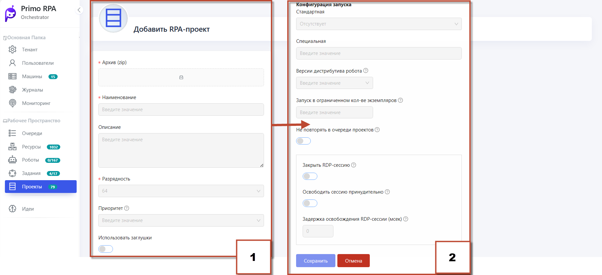
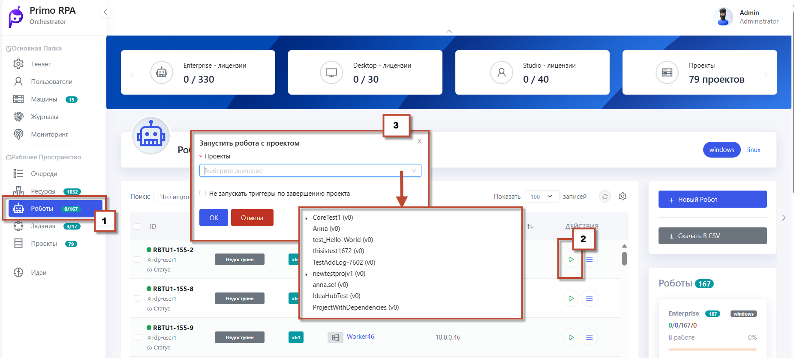
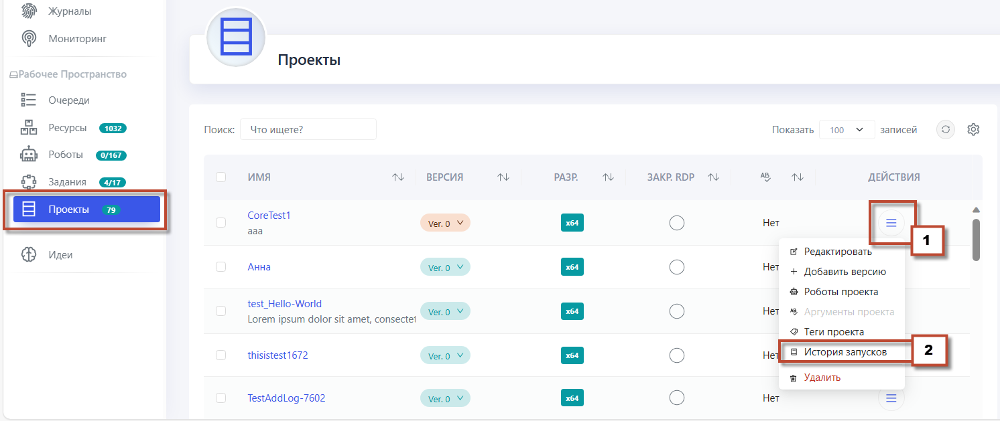

# Добавление и запуск RPA-проекта

RPA-проекты составляют важную часть функционала оркестратора. Они играют ключевую роль в обеспечении эффективного управления и выполнения автоматизированных задач. 
Сами проекты создаются не в Оркестраторе, а в **Primo RPA Studio**. 
Однако Оркестратор выполняет важную функцию в управлении этими проектами, предоставляя средства для планирования, назначения задач роботам, мониторинга выполнения задач и обработки исключительных ситуаций.

## Добавление RPA-проекта

   - Перейдите в веб-интерфейсе Оркестратора в раздел **RPA-проекты** .
   - Нажмите кнопку **Добавить проект**.

 - Обратите внимание на следующие параметры добавляемого проекта/версии:
 - **Приоритет** - определяет порядок выполнения проекта из очереди. Порядок гарантируется только при наличии проектов с разными приоритетами.
 - **Закрыть RDP-сессию**- при завершении проекта будет закрыта открытая RDP-сессия, если эта опция включена.
 - **Запуск в ограниченном количестве экземпляров** - проект не будет запущен, если уже работает в нескольких экземплярах.
 - **Не повторять в очереди проектов**- проект не будет добавлен в очередь, если он уже в ней есть.
 - Нажмите **Сохранить**.
   
 Теперь у вас есть созданный проект. Вы также можете добавить новую версию уже существующего RPA-проекта. 
Для этого выберите нужный проект и в контекстном меню выберите **Добавить версию**. Все версии проекта сгруппированы для удобства.

## Запуск RPA-проекта

 - Перейдите в раздел **Роботы**.  
 - Нажмите **Запуск Робота с проектом**.
 - Выберите проект и нажмите **ОК**.  
 - Обратите внимание на информацию в колонке **Статус**. 
 - Нажмите в контекстном меню  **Консоль**,чтобы посмотреть выполнение уже запущенного робота.
 - Робот завершит задание.

   
## Истории запусков

Информация об истории запуска включает данные о времени начала и окончания запуска, указывает, был ли запуск он инициирован вручную. 

Подробнее в [видеоинструкции](https://www.youtube.com/watch?v=paXGN7TD_Zk&t=879s).
