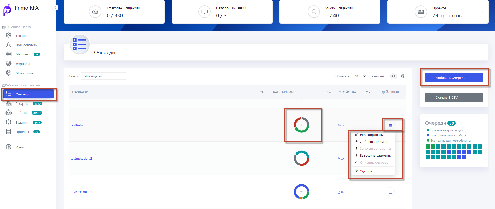
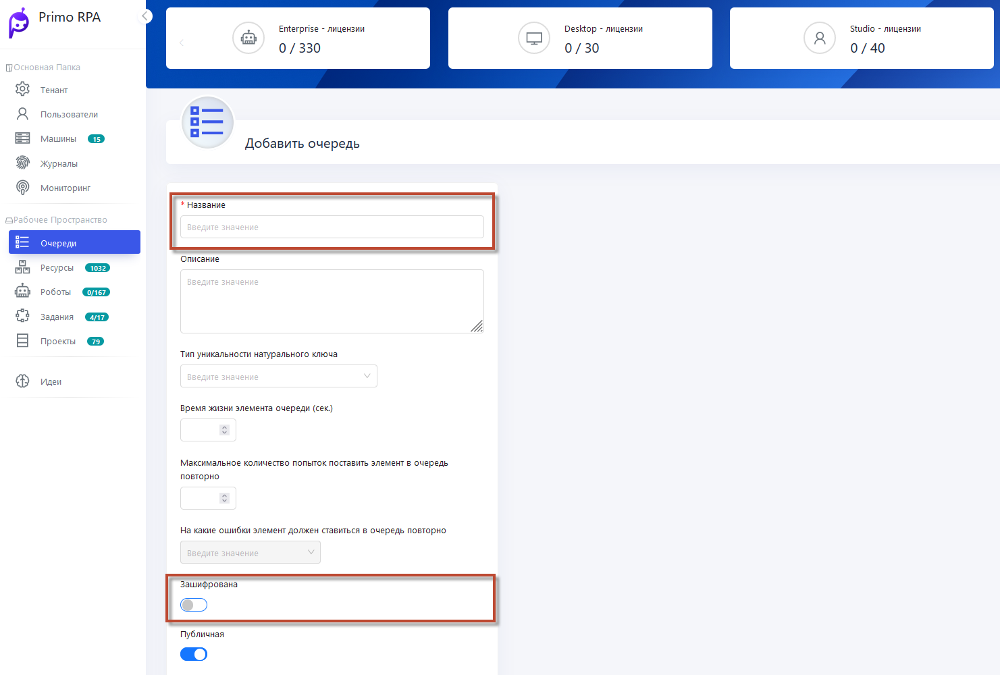
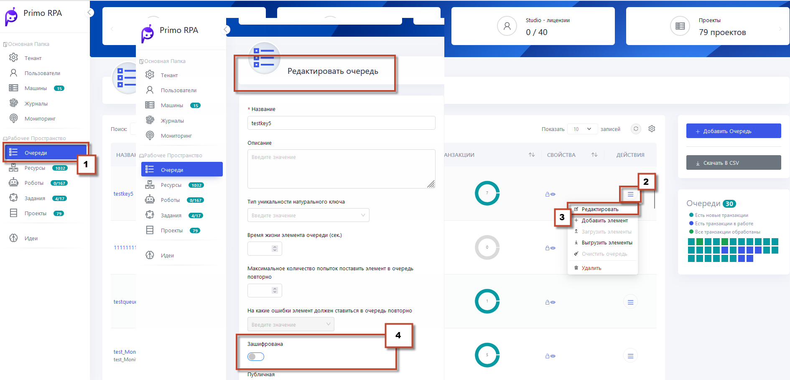
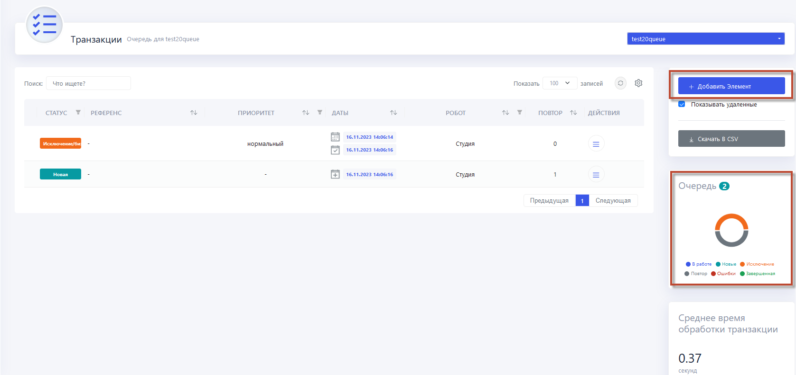
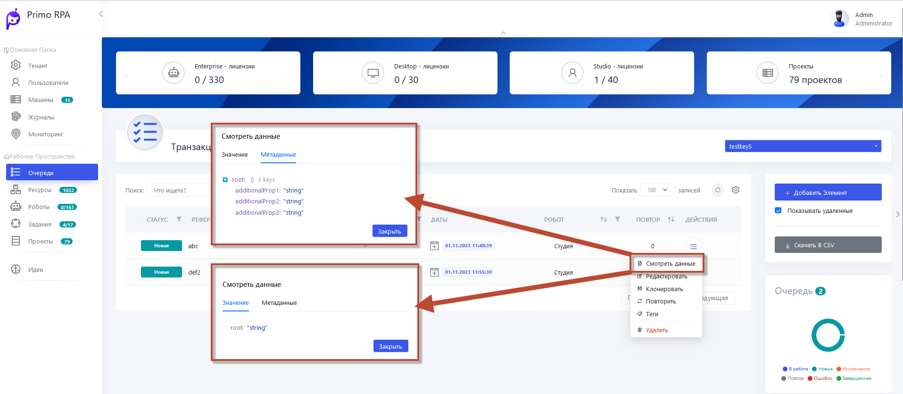
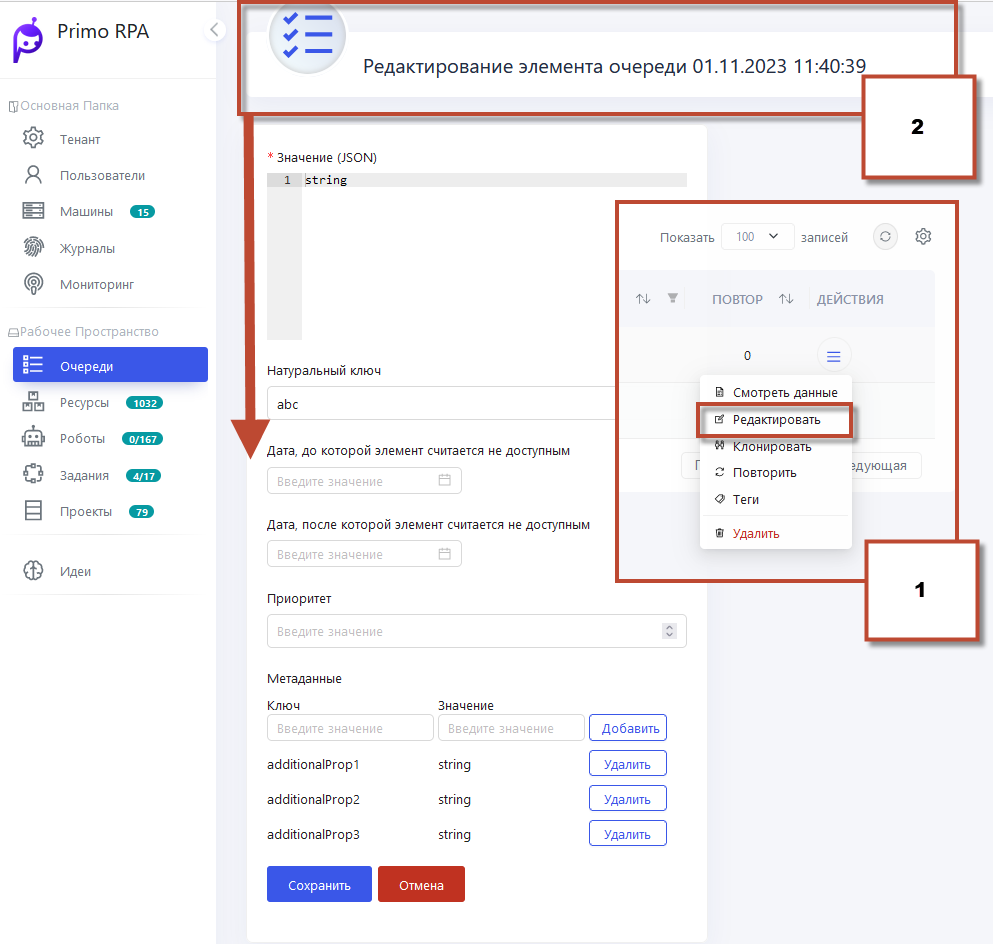
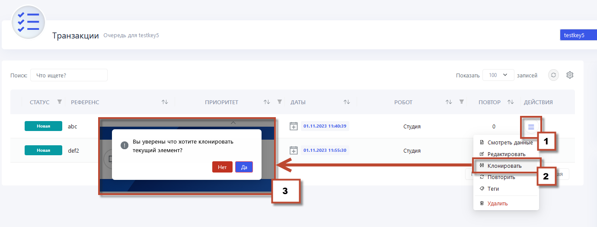
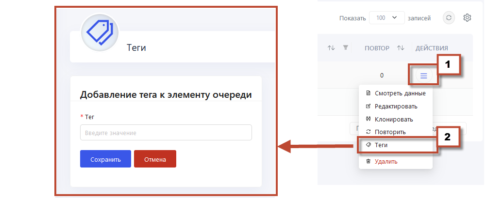
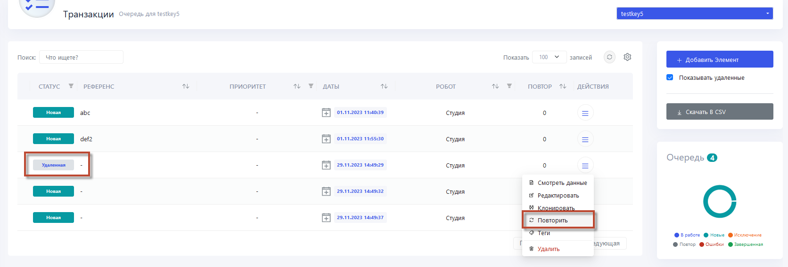
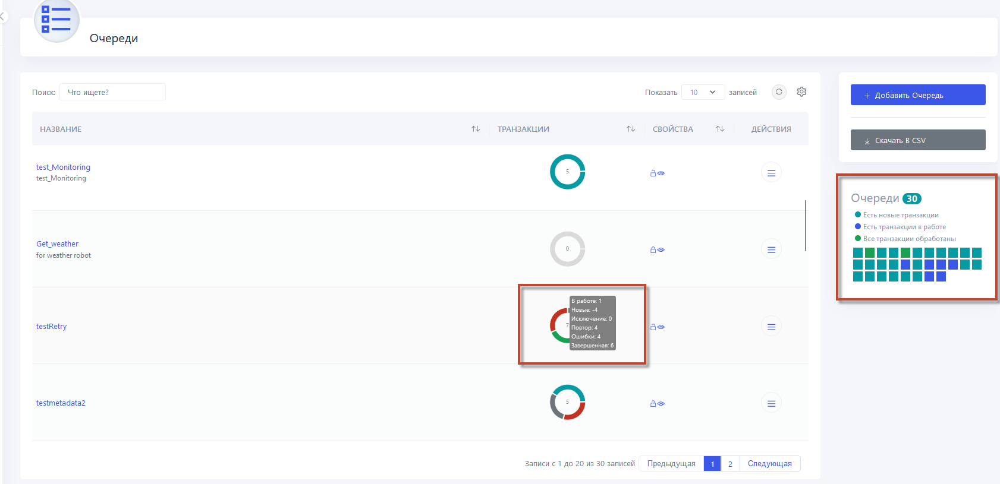

# Очереди обмена данными 

Очередь  представляет собой контейнер данных в хранилище Оркестратора. Очереди позволяют организовать взаимодействие Студии и роботов Оркестратора при выполнении RPA-проектов.

Элемент очереди (транзакция) представляет собой информацию, полученную роботом при выполнении RPA-проекта. 
Важно отметить, что эта информация может быть использована другими роботами Оркестратора в будущем. 
Очередь позволяет хранить неограниченное количество элементов, что дает возможность управлять большим объемом данных, связанных с выполнением RPA-проектов.

В работе очередей используется принцип **FIFO (Первым пришёл – первым обслужен)**
Этот принцип гарантирует, что элементы обрабатываются в порядке их поступления в очередь.

### Работа по FIFO

Для соблюдения принципа FIFO необходимо правильно сформировать RPA-сценарий. Для извлечения элемента по FIFO используйте компонент [Получить из очереди](https://docs.primo-rpa.ru/primo-rpa/g_elements/el_basic/els_orch/els_queues/readfromqueue). В этом случае Робот будет получать для обработки первый элемент, вошедший в очередь.

### Работа без FIFO

Работа по этому принципу предполагает, что Робот может обратиться к любому незанятому элементу, а не только к первому. 

Пример:

1. Обратиться к элементу напрямую по его идентификатору (ID). Для этого используйте в сценарии компонент [Получить из очереди по ID](https://docs.primo-rpa.ru/primo-rpa/g_elements/el_basic/els_orch/els_queues/peekqueueid). 
Извлеченный элемент можно сразу занять для обработки роботом (с помощью свойства **Занимать**).
2. Извлечь из очереди список элементов, используя настроенный фильтр. В том числе с чекаутом: извлечь и сразу занять. 
Это гарантирует, что другие роботы не смогут прочитать занятые элементы. Данный механизм можно считать аналогом FIFO, только для множественного чтения и с более оптимальным использованием блокировок в БД. 
Для получения элементов в этом случае используется компонент [Получить из очереди по фильтру](https://docs.primo-rpa.ru/primo-rpa/g_elements/el_basic/els_orch/els_queues/peekqueuefilter).

## Создание Очереди:

1. В веб-интерфейсе  Оркестратора перейдите в раздел **Очереди**.
2. Нажмите кнопку **Добавить очередь**.
3. Заполните форму с необходимыми данными.
4. Нажмите **Сохранить**, чтобы завершить создание очереди.

**Шифрование Очереди:**
   1. Откройте настройки выбранной очереди и убедитесь, что она зашифрована (значок замка закрыт).
   2. Для включения шифрования для существующей очереди, выберите соответствующий флаг при создании Очереди. Также можно изменить настройку шифрования при **Редактировании** уже созданной очереди.

## Добавление Элементов:

1. Выберите нужную очередь, нажав название **Очереди**
2. Нажмите **Добавить элемент**.
3. Заполните значения элемента, включая описание, натуральный ключ и другие параметры.
4. Нажмите **Сохранить**, чтобы добавить новый элемент в очередь.

**Метаданные и Значения Элементов:**
  Метаданные представляют собой дополнительные атрибуты элементов очереди
   1. **Для просмотра** метаданных и значений нажмите на название нужной очереди.
   2. В списке элементов (транзакций) в поле контекстного меню выберите **Смотреть данные**. В появившемся окне отобразятся значения.

   
   
  1. **Для редактирования** Метаданных в поле контекстного меню выберите **Редактировать**
  2. Откроется окно, в котором возможны изменения ключа, значения и других параметров.

  

 **Клонирование Элементов:**
   1. Выберите элемент очереди, который необходимо клонировать.
   2. Нажмите на опцию **Клонировать** и система запросит подтверждение перед созданием копии элемента.

      

 **Теги:**
   1. При работе с элементами очереди нажмите на опцию **Добавить тег**.
   2. Заполните форму с указанием тегов для элемента. Можно добавление нескольких тегов для категоризации данных.

     

 **Удаление и Восстановление Элементов:**
 Для удаления элемента из очереди выберите его и выполните операцию удаления. Удаленные элементы будут отображаться серым цветом. Для восстановления элемента выберите опцию **Повторить** в 
 контекстном меню элемента. Это облегчает управление элементами и их восстановление в случае необходимости.

     

**Диаграмма Статусов:**

После создания очереди вы можете найти ее в разделе **Очереди**. Здесь отображается диаграмма, отражающая количество элементов очереди в различных статусах. Оркестратор предоставляет различные индикаторы состояния очередей, что помогает в наблюдении за процессами обработки данных.

     

**Переключение между Очередями:**
В новом интерфейсе Оркестратора имеется удобное выпадающее меню, позволяющее быстро переключаться между разными очередями. Просто выберите нужную очередь из выпадающего меню для быстрой навигации между ними, что упрощает управление множеством очередей и задач.

Видеоинструкция доступна по [ссылке](https://www.youtube.com/watch?v=paXGN7TD_Zk&t=313s).
