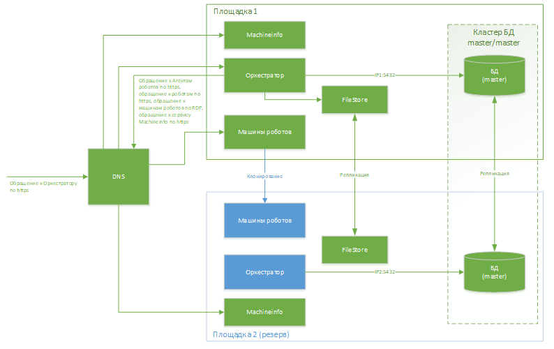

# Рекомендации по обеспечению доступности

Обеспечить доступность можно за счет георезервирования. Оно используется на 2-х площадках – основной и резервной (геокластер). 
Резервная площадка холодная.\
Более простым вариантом обеспечения доступности является резервное копирование.

## Общая схема георезервирования

Общая схема георезервирования с репликацией БД и файловых хранилищ и клонированием машин Роботов приведена на рисунке ниже:

Отсутствие стрелки от DNS (балансера) означает, что запросы на резервную площадку не идут. Синий – узел выключен физически. 
Оркестратор на каждой площадке обращается только к серверу кластера БД (master/master). Кластер БД – это репликация, без балансировки.

Особенность работы Оркестратора с лицензиями требует, чтобы сервис MachineInfo (привязка к оборудованию) был горячим одновременно на 2-х площадках 
в момент создания запросов на лицензии. Позже для работы достаточно одного экземпляра сервиса.

Должно быть обеспечено клонирование машин Роботов между площадками и репликация файловых хранилищ Оркестратора.

Внутри прямоугольник **Оркестратор** также включает RabbitMQ. RabbitMQ для каждой площадки автономный, между узлами RabbitMQ на разных площадках 
репликация не предусмотрена.

## Функционирование геокластера
### Подготовка
Особенность работы Оркестратора с лицензиями требует, чтобы сервис MachineInfo (привязка к оборудованию) был горячим одновременно на 2-х площадках 
в момент создания запросов на лицензии. Обращение к нему должно быть по доменному имени. Оркестратор знает сразу все имена MachineInfo на всех 
площадках.

Позже для работы достаточно одного экземпляра сервиса.

Узел оркестратора на резервной площадке выключен, чтобы фоновые службы Оркестратора не вносили ошибки в работу системы по причине несвязности узлов RabbitMQ.

###  Штатная работа основной площадки
Оркестратор работает с автономным для площадки RabbitMQ, с узлом БД этой площадки (реплицируется на узел БД на резервной площадке) и автономным 
узлом MachineInfo для площадки.

###  Переход на резервную площадку
В DNS (или похожем механизме) осуществляется перенаправление на машины Роботов на резервной площадке и на Оркестратор на резервной площадке.\
Узел Оркестратора включается.\
Работа в части лицензий не нарушается, так как на шаге **Подготовка** лицензии привязаны ко всем узлам MachineInfo, а для работы достаточно одного 
узла.\
Работа в части БД не нарушается, так как узел БД на резервной площадке реплицирован.

###  Устранение последствий
После устранения последствий можно заменить лицензии под новый кластер узлов MachineInfo.

## Резервное копирование
Если не использовать георезервирование, то обеспечить доступность (при снижении SLA) также можно резервным копированием: 

Таблица 1 - Резервное копирование

| Сервер   | Период | Тип      | Примечание  |
| -------- | ------------- | -------- | ----------- |
| БД       | Раз в сутки   | Бэкап БД |             |
| Оркестратор | Раз в сутки | Всего сервера | Оркестратор может быть совмещен с FileStore на одном сервере |
| FileStore | Раз в сутки | Всего сервера   | См. строку выше |
| Кластер серверов с MachineInfo | Разово при развертывании Оркестратора | Всего сервера | Введение в кластер MachineInfo нового сервера возможно только до формирования запросов на лицензии |
| Машина роботов | Раз в сутки | Всего сервера |    |