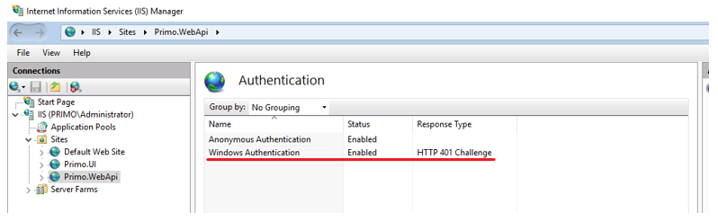
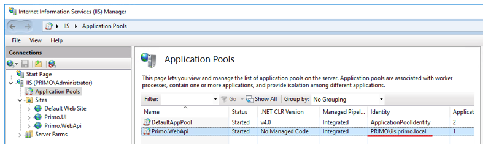
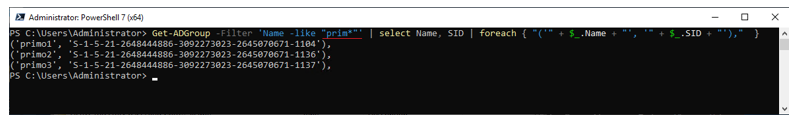
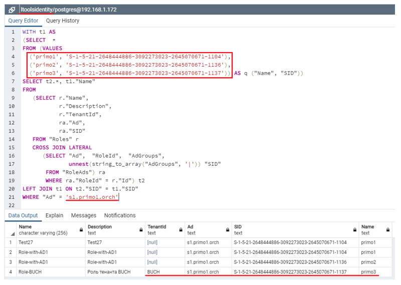

# Интеграция с Active Directory

Интеграция со службой Active Directory (далее - AD) осуществляется следующим образом:

1\. Front Сервис Оркестратора регистрируется в AD и DNS. См. статью [Руководство по установке и настройке AD для SSO] (???????).\
2\. В зависимости от ОС и варианта развертывания:
   * Для Windows 2016 Server и варианта развертывания **WebApi и Front работают под IIS** сервер с IIS может быть включен в AD.\
   Тогда в IIS для узла Primo.WebApi должна быть разрешена аутентификация Windows, а пул приложений этого узла должен работать под доменной SPN учетной записью, полученной при регистрации сервиса в AD:

Разрешение аутентификация Windows для узлов в IIS:

   

Пользователь, под которым работает пул приложений Primo.WebApi:

  

   * Для ОС Linux, или варианта развертывания для Windows 2016 Server **WebApi – служба Windows, Front – nginx**, или если сервер с IIS не включен в AD – только на основе keytab-файла. 

3\. В конфигурационном файле WebApi в секции **ActiveDirectory** нужно прописать настройки для каждого AD, чтобы в UI Оркестратора роль Оркестратора могла быть ассоциирована с группой AD:

```json
"ActiveDirectory": {
    "KerberosKeytabPath": "C:\\Primo\\krb5.keytab",
    "Type": 5,
    "MultyForest": {
      "primo1.orch": {
        "ConnectionTimeout": 2000,
        "Host": "185.247.193.52",
        "UseSsl": false,
        "AcceptUntrustedCertificate": false,
        "AdminUserName": "Administrator@primo1.orch",
        "AdminPassword": "JLWIyl1xZNDVVx8tcVllOg==",
        "StartPoint": "CN=Users,DC=primo1,DC=orch",
        "UserFilterTemplate": "(&(objectCategory=user)(objectClass=user)(userPrincipalName={0}))",
        "GroupsFilter": "(&(ObjectClass=group))",
        //"GroupsFilter": "(&(ObjectClass=group)(|(cn=primo)(cn=another)))",
        "Tenants": [ "", "BUCH" ],
        "TrustedDomains": []
      },
      "primo2.orch": {
        "ConnectionTimeout": 2000,
        "Host": "185.247.193.88",
        "AdminUserName": "Administrator@primo2.orch",
        "AdminPassword": "JLWIyl1xZNDVVx8tcVllOg==",
        "StartPoint": "CN=Users,DC=primo2,DC=orch",
        "UserFilterTemplate": "(&(objectCategory=user)(objectClass=user)(userPrincipalName={0}))",
        "GroupsFilter": "(&(ObjectClass=group))",
        //"GroupsFilter": "(&(ObjectClass=group)(|(cn=primo)(cn=another)))",
        "Tenants": [ "" ],
        "TrustedDomains": []
      }
    }
  },
```
Для AD-групп в параметре **GroupsFilter** может быть произведена более точная фильтрация, например, по названиям групп:

* Путем явного перечисления через ИЛИ:

`(&(ObjectClass=group)(|(cn=primo)(cn=another)))`

* С использованием регулярного выражения:

`(&(ObjectClass=group)(cn=prim*))`

Если фильтрация не используется, может возникнуть ошибка при запросе слишком большого количества групп.

Если не используется одновременно несколько AD, лишний AD должен быть удален.

Наименование AD в конфигурационном файле WebApi рекомендуется выбирать в соответствии со значениями DC в параметре **StartPoint**, например, для primo1.orch - `DC=primo1`, `DC=orch`.

В таблице ниже приведено описание параметров для настройки AD, которые администратор может менять.

#### Таблица 1 – Описание параметров для настройки AD.

| Параметр               	| Назначение	| Примечание |
| ----------------------- | ----------- | ---------- |
| Type                    | Настройка формы авторизации. Возможные значения 1 (авторизация только в Оркестраторе) и 5 (авторизация в Оркестраторе или SSO) |  |
| primo1.orch, primo2.orch и т.д. | Точные названия AD, без сокращения, со всеми поддоменами. Должны быть заменены | Рекомендуется использовать префиксы наименований, чтобы отфильтровать в GroupsFilter |
| Host                    | 	Адрес AD  |            |
| UseSsl                  | Используется LDAPS |     |
| AcceptUntrustedCertificate | При использовании LDAPS опеределяет допустимость невалидного SSL-сертификата |  |
| AdminUserName          | Имя учетной записи, имеющей права на просмотр каталога AD |            |
| AdminPassword          | Зашифрованный пароль	 | См. статью [Атрибуты безопасности] (????????) |
| StartPoint             | Уровень, с которого просматривается каталог. Параметры DC должны соответствовать названию AD. Параметр CN не меняется |   |
| Tenants                | Массив идентификаторов тенантов, которые относятся к AD  | См. [Мультитенантность] (????????) |
| TrustedDomains         | Массив доменов (в нижнем регистре), из которых пользователь может авторизоваться в домене (при настроенных доверительных отношениях между доменами), в котором зарегистрирован сервис Оркестратора |     |	

Рабочие станции, на которых запускается UI Оркестратора, должны быть включены в AD.

## Типовые проблемы

Если возникают проблемы при настройке SSO, требуется пошагово проверить настройку.

Проверка, что группа AD пользователя, который авторизуется в Оркестраторе по SSO, привязана к роли Оркестратора в БД: **\<имя роли\>** - имя роли Оркестратора, к которой должна быть привязана группа AD \<имя группы\>.

**Шаг 1:**\
На рабочей станции, включенной в AD (через cmd):
```
#whoami /groups
```
Среди групп должна быть (определяется по SID) группа AD, которая привязана к роли Оркестратора в БД (см. шаг 3).

**Шаг 2:**\
На сервере контроллера AD (через PowerShell):

```
#Get-ADGroup -Identity <имя группы>
```
SID группы AD должен быть привязан к роли Оркестратора в БД (см. шаг 3) и должен содержаться среди SID на шаге 1.

**Шаг 3:**\
В БД ltoolsidentity:

```
select r."Name",
       r."TenantId",
       ad."Ad",
       ad."AdGroups"
 from "Roles" r
 inner join "RoleAds" ad on ad."RoleId" = r."Id"
 where r."Name" = '<имя роли>'
```
Запрос вернет привязку по SID к \<имя роли\> групп AD.

Поле RoleAds.Ad в БД ltoolsidentity, название AD в конфиге WebApi (секция **ActiveDirectory:MultyForest**) и название AD, которое приходит из AD при авторизации, должны совпадать. Если они отличаются, необходимо привести их в соответствие и перезапустить службу Primo.Orchestrator.WebApi.
 

**Шаг 4 (необязательный)**:\
При помощи запроса в PowerShell получаем из AD все группы, предназначенные для использования в Оркестраторе:

```
# Get-ADGroup -Filter 'Name -like "prim*"' | select Name, SID | foreach { "('" + $_.Name + "', '" + $_.SID + "'),"  }
```
Например, используя префикс **prim** (может использоваться другая фильтрация).



Копируем полученный результат в SQL-запрос к БД ltoolsidentity:
```sql
WITH t1 AS 
(SELECT  *
FROM (VALUES
  ('primo1', 'S-1-5-21-2648444886-3092273023-2645070671-1104'),
  ('primo2', 'S-1-5-21-2648444886-3092273023-2645070671-1136'),
  ('primo3', 'S-1-5-21-2648444886-3092273023-2645070671-1137')) AS q ("Name", "SID"))
SELECT t2.*, t1."Name"
FROM
   (SELECT r."Name", 
	    r."Description", 
	    r."TenantId", 
	    ra."Ad",	   
	    ra."SID"
   FROM "Roles" r 
   CROSS JOIN LATERAL
      (SELECT "Ad",  "RoleId",  "AdGroups", 
                     unnest(string_to_array("AdGroups", '|')) "SID" 
       FROM "RoleAds") ra 
   WHERE ra."RoleId" = r."Id") t2
LEFT JOIN t1 ON t2."SID" = t1."SID"
WHERE "Ad" = 's1.primo1.orch'
```
Здесь вместо **s1.primo1.orch** нужно подставить название своего домена. 



По результату запроса видно, что AD-группа **primo3** относится к тенанту BUCH. Это значит, что Оркестратор не даст привязать AD-группу primo3 к роли другого тенанта, так как AD-группа может быть привязана только к ролям одного тенанта (если не разрешена мультитенантная AD-авторизация - см. [Мультитенантность] (?????)).

Если привязка правильная, имеет смысл переименовать AD-группу **primo3** в **primo3-BUCH**, чтобы в UI Оркестратора была видна принадлежность AD-группы к тенанту (через роль).

Если привязка неправильная, и AD-группа **primo3** должна использоваться в другом тенанте, сначала нужно отвязать её от ролей тенанта BUCH.


