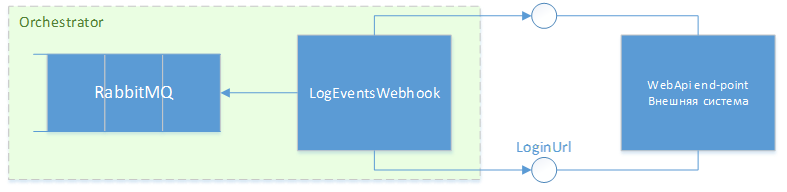

# Интеграция с внешними системами 

## Интеграция через Webhooks

Для интеграции с внешними системами имеется возможность использовать Webhooks на события Оркестратора:



Для этого требуется:

* Развернуть службу LogEventsWebhook\*, настроить её на получение событий из RabbitMQ и обращение к WebApi внешней системы.
* Разработать и развернуть WebApi (интеграционный шлюз) с 2-мя end-point для приема событий от Webhooks. Этот WebApi заказчик разрабатывает самостоятельно в соответствии со спецификацией\**. 
* Разрешить Webhooks на события Оркестратора в конфигурационном файле Оркестратора. Разрешение настраивается в секции `Integration: EventWebhook:Enabled`:

```json
"Integration": {
    "EventWebhook": {
      "Enabled": true
    }
```
После настройки интеграции можно проверить её работу, сопоставив записи журнала Оркестратора с записями в хранилище, в котором сохраняются события от Webhooks.

> \* См. статьи [Установка LogEventsWebhook как службы под Windows 2016 Server](../../orchestrator-new/install/windows/additional-components-win/logeventswebhook-win.md) или [Установка LogEventsWebhook под CentOS](../../orchestrator-new/install/linux/additional-components-linux/logeventswebhook-linux-centos.md).\
> \*\* См. статью [Спецификация WebApi на прием событий Оркестратора] (?????). 

## Аналитическая БД

Предагрегированная аналитическая информация о событиях содержится в аналитической БД.
