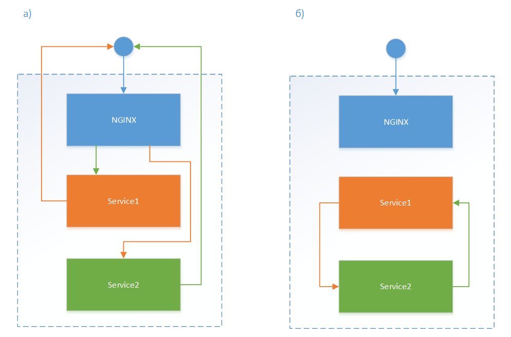

# Перенаправление http-зависимостей между службами

В типовой конфигурации службы, которые общаются друг с другом по http, делают это через обращение к внешнему эндпоинту – nginx/IIS. В этом случае балансировка осуществляется средствами nginx/IIS (рисунок а). 

Это поведение может быть изменено – службы будут обращаться друг с другом непосредственно (рисунок б) через внутренние эндпоинты. 
Такая конфигурация имеет преимущества для развертывания служб в k8s, так как в нем имеется встроенные резолвер имен служб и балансировщик.

Для этого требуется задать параметры в конфигурационном файле – внутренние k8s имена\* служб:
1.	WebApi – RobotLogs.BaseUrl
2.	RobotLogs – Orchestrator.BaseUrl
3.	States – Orchestrator.BaseUrl
4.	Analytic – Orchestrator.BaseUrl

> \* - Можно задать IP, но, тогда не будет балансировки.

